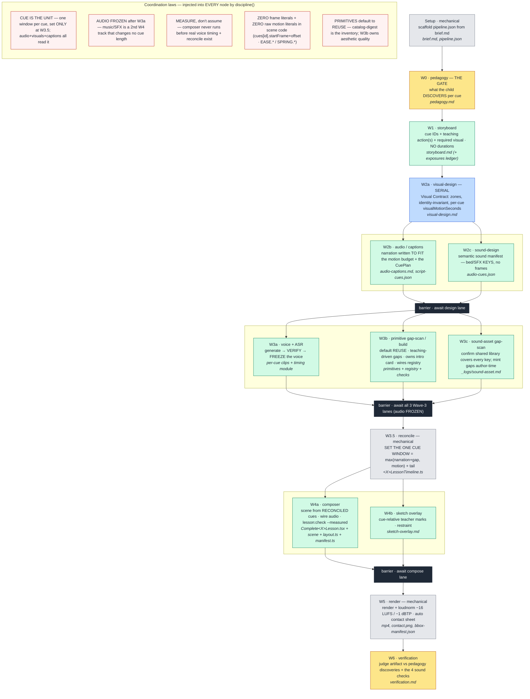

# Skill-system map — animation-test

_The diagnostic context surface. Generated by the `hermes-skill-system` skill (INIT), 2026-06-08. Free-form, no scores, no fixed schema — notes encouraged. Refresh whenever the system's shape changes; append to the Diagnostics log as you fix things so this map gets **more certain** with every run._

**How to read it:** to diagnose a flaw, read the **user-surface problem** + this map (composition + responsibilities) + the **run's real evidence** (see Runtime observability) together. That triangulation gives the top candidate to fix. Prefer fixing the **chain** (the orchestrator) over a single skill when the flaw is coordination/hand-off.

**Sibling fixture — `.agents/skill-system-criteria.md`:** the per-node OUTPUT ACCEPTANCE CRITERIA (the human-judged quality bar for each producing node's artifact; the standard we judge runs against to converge on quality, and the improvement target we sharpen as the system matures). Generated by the `node-output-criteria` workflow; a JUDGING fixture, **NEVER injected into a node's prompt** (that would teach-to-the-test and void the clean-room signal). Edit it when our expectation of a node's output shape changes (richer shape, more data, a new must-have). Pairs with the mechanical Output Contract (`contract()` in `lesson-build.js`, existence + lane) and this map (composition + diagnostics).

---

## Orchestration (the chain)
- **`.claude/workflows/lesson-build.js`** — THE orchestrator (dev). One self-contained loop, one lesson per run (`args.lessonId`), runnable in parallel. Owns wave order, the parallel/serial lanes, preflight, and the shared **`discipline()`** preamble that injects the CLAUDE.md laws into *every* node. Its own rule: *"improve a wave by editing its SKILL; improve the chain by editing this file."* **Fix coordination/ordering/hand-off here, not in a skill.**
- **`.claude/workflows/capability-gap-filler.js`** — separate workflow: library-wide capability factory (proactive, not per-lesson). Skill: `capability-gap-filler`.
- **`pi-runner/`** — PRODUCTION executor. Does NOT redefine the waves — `pi-runner/extract.mjs` *executes* `lesson-build.js` under recording stubs to derive identical prompts + DAG. So **`lesson-build.js` is the single source of truth**; never hand-sync pi.

## The wave DAG (nodes · responsibilities · lanes)
_Generated from `.claude/workflows/lesson-build.js` (the source of truth) — the serial backbone, the three parallel lanes (Design / Voice & Assets / Compose), the `parallel()` barriers between phases, and the coordination laws `discipline()` injects into every node. Node colours: 🟨 gate · ⬜ mechanical · 🟦 serial · 🟩 authoring · ⬛ barrier. Refresh this block when the wave order changes (it is the visual twin of the table below)._



## Nodes → responsibility · reads · writes
| Node (wave) | Responsibility (what it's responsible for) | Reads (skills/docs) | Writes (artifacts) |
|---|---|---|---|
| Setup | make the lesson runnable; scaffold mechanical pipeline.json | `complete-video-pipeline` | brief.md, pipeline.json |
| W0 pedagogy | the gate: what the child DISCOVERS per cue | `lesson-pedagogy` | pedagogy.md |
| W1 storyboard | tag each cue with teaching action(s) → cue IDs + narration-beat intent + required visual; NO durations | `lesson-storyboard`, **`.agents/TEACHING-ACTIONS.md`** | storyboard.md (carries teaching action(s) per cue) |
| W2a visual-design (SERIAL) | Visual Contract: zones, identity-invariant, per-cue visualMotionSeconds | `kids-eye`, `visual-discipline`, `early-childhood-visual-taste`, CAPABILITIES.md, (styles) | visual-design.md |
| W2b audio/captions | narration written TO FIT the motion budget; the CuePlan | `lesson-audio-captions`, `cue-plan-author` (kit) | audio-captions.md, script-cues.json |
| W2c sound-design | semantic sound manifest (bed/sting/SFX **keys**, no frames) | `lesson-sound-design` | audio-cues.json |
| W3a voice+ASR | generate → **VERIFY** → **FREEZE** the voice timing | `tts-voice-direction` (kit), `asr-cue-aligner` (kit) | voice.wav, gemini-voice.json, asr-alignment.json, generated timing modules |
| W3b primitive gap-scan/build | reuse-or-build primitives (default REUSE); **teaching-driven gap detection** (map move→`requires`→catalog, not off a drawn layout); owns the intro card; owns primitive AESTHETIC quality; wire the registry | **`primitive-builder`** (its dedicated skill), storyboard (teaching actions), **`.agents/TEACHING-ACTIONS.md`**, `visual-discipline`, `kids-eye`, CAPABILITIES.md, catalog-digest.md, primitive-registry.json | primitive-gap-scan.md, src/shape-primitives/*, registry, primitive-checks/*.png |
| W3c sound-asset | confirm the shared library covers every key; mint gaps author-time | `lesson-sound-design` (asset side), sound kit library | _logs/sound-asset.md |
| W3.5 reconcile | set the ONE cue window; embed the shared timeline (mechanical) | — (narration-kit `reconcileCueTimeline`) | `<X>LessonTimeline.ts` |
| W4a composer | build the scene from reconciled cues; wire audio; run `lesson:check --measured` | `remotion-lesson-composer`, CAPABILITIES.md | Complete`<X>`Lesson.tsx, scene, layout.ts, manifest.ts |
| W4b sketch | hand-drawn teacher marks, cue-relative (restraint) | `sketch-explainer-layer` | sketch-overlay.md |
| W5 render | render + loudnorm (−16 LUFS/−1 dBTP); auto contact sheet (mechanical) | — | mp4, contact.png(+json), bbox-manifest.json |
| W6 verification | judge the artifact vs pedagogy discoveries + the 4 sound checks | `lesson-verification` | verification.md |

**Off-wave skills (system, not in waves 1–6):** `lesson-debugger` (post-render feedback triage — symptom→wave mapping; loaded only when the human reports an MP4 issue) · `complete-video-pipeline` (orchestrator overview) · `capability-registry-harness` (the drift-gate method) · `capability-gap-filler` (library-wide factory).

## Skills inventory (canonical home per CLAUDE.md "Skill ownership")
- **This repo — `.agents/skills/`:** lesson-pedagogy, lesson-storyboard, kids-eye, visual-discipline, early-childhood-visual-taste, lesson-audio-captions, lesson-sound-design, remotion-lesson-composer, primitive-builder, sketch-explainer-layer, lesson-verification, lesson-debugger, complete-video-pipeline, capability-gap-filler. (Mirrored into `~/.claude/skills/` as symlinks — edit at the target.)
- **Shared kits (owned elsewhere):** `shared-narration/.agents/skills/` → tts-voice-direction, asr-cue-aligner, cue-plan-author · `shared-3d/.agents/skills/` → three-effects-composition, three-effects-registry, three.
- **Global:** transform-workflow-to-pi · **hermes-skill-system** (this method).

## Governing docs & registries (owners too)
- **`CLAUDE.md`** — the constitution: Entry Point, wave order, the **Discipline laws** (cue-as-unit, audio-frozen, measure-don't-assume, zero frame/motion literals, bbox manifest vs `--measured` truth), Skill ownership, Styles, 3D-decorative-only, generated-asset rules. Injected into every node via `discipline()`. **Laws and facts usually belong here, not in a wave skill.**
- **`docs/pipeline-architecture.md`** — timeline-coordination architecture (cue-as-unit, frozen audio, W3.5 reconcile). The "why" behind the laws.
- **`docs/proposals/machine-gated-verification.md`** — the `--measured` gate spec. · **`docs/IMPLEMENTATION-HANDOFF.md`**.
- **Capability registry:** `.agents/CAPABILITIES.md` (hand-authored prose) + `src/capabilities/primitive-registry.json` + generated `catalog-digest.md` (drift-gated, code-as-truth; `npm run registry:check`). The authoritative "what components exist" list. **Generated component sections:** `primitives` (counting/literacy/interaction/sketch/asset families) · `motionComponents` · `fxComponents` · **`lessonComponents`** (the scene-mountable lesson-INFRA surface — `media` audio/caption layers, `transition` decorative-3D handoffs, `style` wrapper — swept from `src/lesson-media/components.ts` + `src/lessons/transitions/index.ts` + `src/styles/components.ts`). Plus generated `motionVocabulary`, membership-gated `styles` (style IDS, distinct from the `style`-family component), manifest-authored `recipes`. The `lessonComponents` sweep makes the registry the COMPLETE component universe so the lesson↔registry gate (`registry:check-lesson`) is allowlist-free at the scene level.
- **Teaching-action registry:** `.agents/TEACHING-ACTIONS.md` — the pedagogical twin of CAPABILITIES.md: the menu of teaching MOVES (what we teach *with*) + each move's `requires` (audio | visual/layout | component). Read by storyboard (tag cues), visual-design + composer (honor `requires`), gap-scan (map move→capability). The layer that makes planning teaching-first instead of layout-first. Reinforcement-move *dosage* is reasoned in `lesson-pedagogy` §8; the *requirement* lives here.

## Runtime observability — where each run leaves evidence (read these to diagnose)
Three tiers (CLAUDE.md "Observability"), cheapest first, plus the products:
1. **Structured returns (tier 1):** every node returns `{node, status, outputArtifacts, summary, issues, pipelineFindings}`; `lesson-build.js` aggregates them. **The union of all `pipelineFindings` = the workflow-improvement backlog** — the first thing to read.
2. **Per-node logs (tier 2):** `remotion-svg-primitives/lesson-data/<id>/_logs/<wave>.md` — INPUTS READ / OUTPUTS WRITTEN / COMMANDS RUN (+exit +key stdout-stderr) / KEY DECISIONS / ISSUES / PIPELINE FINDINGS. Addressable by wave.
3. **Raw transcripts (tier 3):** `agent-<id>.jsonl` per node under the run's transcript dir (Workflow runtime) / pi-runner — every tool call, for exact reproduction.
- **Run status:** `out/<id>/run-status.json` (pi-runner `--debug`; artifact-verified node status).
- **Product artifacts for diagnosis:** `out/<id>/<id>.mp4`, `<id>-contact.png` (+json) — the primary review surface, `bbox-manifest.json` (linear + `measured` collisions, `gatesFailed`, LUFS), `gemini-voice.json`, `asr-alignment.json`, `primitive-checks/*.png`, `lesson-data/<id>/verification.md`.
- **Prior diagnostics on file:** `docs/lesson-build-shakedown-fixlog.md` (first e2e run fix log).

## Diagnostics log (append-only — makes this map more certain)
_The **product-quality ledger**: one line per skill/workflow edit that changes what the artifact-production pipeline PRODUCES (`date — owner — rule (skillsys <sha>)`). Stewardship-process/method edits and other-repo edits are NOT logged here — `git log` is their record._
- 2026-06-08 — (bootstrap) map created from `lesson-build.js` + CLAUDE.md. No `skillsys` edits yet.
- 2026-06-10 — registry — sweep the lesson-INFRA component barrels (`lesson-media`/`lessons/transitions`/`styles` wrapper) into a new GENERATED `lessonComponents[]` section (7 comps: media=4, transition=2, style=1 → 69 total `.component`), zod-validated + prose-authored, so the registry is the COMPLETE scene-importable component universe and the lesson↔registry gate is allowlist-free at the scene level. (skillsys `3678cf8`) — the RecapSpotlight phantom that hung the composer was the same class: a scene-legit kit layer the gate falsely flagged because it was uncatalogued.
- 2026-06-10 — lesson-build + registry — **the lesson↔registry GATE** (`registry:check-lesson` / `scripts/registry/check-lesson-primitives.mjs`): every component a gap-scan NAMES (JSX opens + reuse-table ids) is diffed against the generated, zod-validated registry `.component` set (the oracle that cannot lie); a name not in it is a GAP, NOT a REUSE. **De-hardcoded set membership** (the user's correction) — no per-case/per-lesson heuristic (NOT "fail if the useWhen has a Chinese string"), so it generalizes to every future lesson + component. Wired into W3b ("REUSE IS MEMBERSHIP, NOT BELIEF" + self-verify) and the W4a composer PREFLIGHT (a flagged name DOES NOT EXIST → do NOT hunt the repo for it — that hunt IS the failure). Gap-scan only (a scene legitimately defines its own non-registry components; a phantom scene import is tsc's job). (skillsys `c6c6849`, `3a6139d`) — root cause: W3b CONFABULATED a catalog REUSE row for `RecapSpotlight` **while the digest was in context**, fabricating a useWhen that baked in the lesson topic, so reading the digest is necessary-but-insufficient — a mechanical diff is the missing gate. Pairs with the `3678cf8` registry-coverage sweep that makes it allowlist-free.
- prior — see `docs/lesson-build-shakedown-fixlog.md` (shakedown diagnostics, first e2e `kp1-hello-greetings`, W6 YELLOW, 2026-06-04).
- prior (not skillsys-tagged) — kp1 flaw 1 (L2 treated differently from L1) + flaw 2b (slideshow rhythm): L2 carve-out + tokenPattern widen + pedagogy §8/§9 reinforcement + storyboard cue-spine, committed `0bccd7a` + `911edf8`.
- 2026-06-08 — teaching-actions (+ lesson-build chain, storyboard, pedagogy §8 xref, CLAUDE.md) — plan teaching MOVES before layout; gap-scan maps move→`requires`→catalog (teaching-driven, not layout-driven). New doc `.agents/TEACHING-ACTIONS.md`. (skillsys `8ac4f64`) — resolves the `teaching-action-vocabulary-gap` open item + kp1 flaw 2a at the source (announce-topic `requires`).
- 2026-06-08 — kids-eye (+ visual-discipline) — generalize occlusion rule: nothing readable is ever occluded, text most of all; both directions; design-time discipline because a fade-in occluder hides from the linear gate. (skillsys `c87c13e`) — kp1 flaw 2a (intro title occluded by cast).
- 2026-06-08 — lesson-pedagogy (+ TEACHING-ACTIONS, audio-captions, visual-discipline) — comprehension time-FLOOR: an acquisition target needs ≥6–10 SPACED exposures + per-item dwell + a ≥3–5s wait-time gap + recap (research-backed: `research/teaching-tempo-pacing-2026-06-08.md`); fixes the "26s should be ~2min" starvation surfaced by the `kptest-greetings-verify` pi run. Total stays emergent — floors are defaults, no hard-coded length. (skillsys `6d79eb1`)
- FOLLOW-UP (code, not skill) — the `--measured` gate should sample the intro title-vs-cast frame and treat text-occlusion as a hard fail; the linear manifest's low-opacity-keyframe blind spot is why kp1's overlay reached W6. Owner: `lesson:check` / `machine-gated-verification.md`. Logged as the next backlog item.
- 2026-06-08 — typed-silence / the gap (kit `@studio/narration-kit` + lesson-pedagogy §8 + TEACHING-ACTIONS + lesson-storyboard + lesson-audio-captions + cue-plan-author + remotion-lesson-composer + lesson-build.js reconcile) — **intentional silence is FIRST-CLASS and TYPED**: kit gains `GapReason` (open union) + `CueGap {seconds, reason}` + `CuePlanItem.gap`; the voice generator's uniform `gapSeconds` scalar becomes a per-cue lookup baked as **zero-cost local silence** (never a TTS call); reconcile UNCHANGED (absorbs the detected WAV silence). Planning: the §8 wait-time stops being a "reconcile follow-up / fake it" hedge and becomes a real `learner-response` gap (echo = its own beat); composer holds a "your turn" affordance; reconcile-node comprehension-floor advisory (reads storyboard `exposures`). Resolves the FOLLOW-UP below. Naming/cost corrections were user-driven (generic `gap`, not `responseGapSeconds`; silence is free). Doc: `docs/pipeline-architecture.md` §10 + v3; proposal `docs/proposals/intentional-silence-timeline.md`. (skillsys `d471f3a`) — REAL validation = pi-agent run on `kptest-greetings-verify` (kit `@studio/narration-kit` is on-disk, NOT git).
- ~~FOLLOW-UP (code, not skill) — the silent **learner-response-gap** as a first-class reconcile timeline beat~~ → **DONE** by the typed-silence work above (baked into the WAV as a `gap`, so reconcile needs no new term; advisory shipped at the reconcile node).
- 2026-06-08 — **v4 CUE-ANCHORED AUDIO** (kit `@studio/narration-kit` types+reconcileClipTimeline+AudioLayer+generate-voice ; lesson `<X>LessonTimeline`/`Complete<X>`/`LessonAudioLayer`/`_padded-cues-extract`/new `lesson-audio-gate.mjs`/`render-complete-lesson` ; skills `lesson-audio-captions`+`cue-plan-author`+`remotion-lesson-composer`+TEACHING-ACTIONS ; `lesson-build.js` laws+W3a/W3.5/W4a ; CLAUDE.md mirror ; `docs/pipeline-architecture.md` v4) — **each cue owns its OWN trimmed voice clip, mounted per-cue (`<Sequence from={cue.start}>`); the continuous WAV is gone.** Resolves the user's two "huge flaws" on `kptest-greetings-verify`: (1) **DESYNC** — the continuous-WAV played the next clip early whenever motion>narration (measured ~5s mid-lesson); per-cue anchoring makes a clip crossing a boundary structurally impossible. (2) **GAP "white noise"** — was a held-vowel DRONE: `I'm…… Sam` ellipsis → Gemini holds the vowel ~5s; banned at source + generator guard + new deterministic **audio gate** (drone+dead-air, auto-run after voice). Also fixes the TTS clip-padding dead-air (clips trimmed) and the contact-sheet narration-marker bug (`source=reconciled`, exact window). Deletes detect-silences + the per-lesson `ASR_CORRECTIONS` hairball. **VALIDATED on real re-TTS'd audio** (skillsys `8d5ce42`): cleaned the 2 ellipsis cues per the new skill → `npm run lesson:voice` (v4 generator) produced 8 trimmed clips (master 36.09s vs the old 52.31s) → **audio gate ✅ PASS** (the 2 former drones 6.1s/4.2s now 0.3s) → re-render 1579f/52.6s → MP4 measured: every cue's clip sits inside its window, the 11–18s drone zone is now speech+silence, the learner gap is silent at 30–34s under the visual hold. Defects 1+2+3 all fixed on the real production path. The full clean-room **pi** rerun (startAt=design) was BLOCKED by qwen looping 1800s on the TRIVIAL `preflight-design` file-existence check (449k tok, 46 tools, thinking varied so REPEAT_KILL missed it) — a pi/qwen flakiness, NOT a v4 issue (it never reached W2a). See the backlog finding below.
- FOLLOW-UP (pi-runner robustness, not product) — `preflight-*` is a pure file-existence check done by an LLM agent; on the cheap qwen coding-plan it can grind to the node-timeout instead of just `ls`-ing. The dev Workflow runtime forbids fs in the script (so it must be an agent there), but the pi driver COULD do mid-start preflight in plain code (fs.existsSync of REQUIRED_PRESENT) before spawning any node — eliminating the flaky-qwen-on-a-trivial-check failure mode. Owner: `pi-runner/run.mjs` (or a driver-side preflight short-circuit). Until then, a clean-room pi rerun may need 1–2 retries past preflight.  → **DONE 2026-06-09 (fcbe124)**: the workflow preflight prompt now emits a DRIVER-PREFLIGHT marker with the abs paths; the pi driver fs-checks them in plain code and resolves the node with NO pi spawn (dev Workflow path unchanged — marker is inert text).
- 2026-06-09 — lesson-pedagogy (+ lesson-storyboard mirror) — BREADTH before depth: the comprehension time-FLOOR is per-target; the key_difficult earns EXTRA practice ON TOP OF, not INSTEAD OF, each co-equal routine's clean model + recap; a final retrieval is a COMPLETE utterance, never a dangling fragment. (skillsys fabda74) — kptest-greetings-verify: the self-intro target got 3 dedicated cues while greet (Hello/Hi) and farewell (Goodbye) got 1 each — the video read as being about one item with the others stapled on.
- 2026-06-11 — lesson-storyboard — FIDELITY ≠ BLIND TRANSCRIPTION: fidelity is to pedagogy's discovery SET + order, not its phrasing. (1) A relation/bond/part–whole/retrieval beat's narration INTENT is the COMPLETE utterance ("name that six splits into one and five"), never a stranded token ("say 一和五") — repaired at W1 even if an upstream draft fragmented it. (2) Ship ONE closing retrieval recap: fold an aggregator+recap that re-present the same full target set into one cue (prompt→wait→reveal-all), keeping two closers only if their retrieval functions are genuinely distinct and made explicit — never two near-identical closers. (skillsys `1dcdf91`) — kptest-fenyuhe-six W1 post-mortem: the storyboard laundered the old pedagogy's backwards fragments ("model the bond 一和五") and shipped reveal-answer + recap as twin closers; fixture red-flag 56.
- 2026-06-09 — lesson-audio-captions (+ storyboard) — a SYNCABLE L2 target leads its cue (spoken onset within ~0.5s of cue start) or gets its OWN short cue; never tail-buried in a carrier sentence. The composer anchors the visual reveal to cue.startFrame and the ASR can't timestamp an embedded L2 word, so a tail target desyncs by seconds. (skillsys ba48de5) — kptest-greetings-verify: Hello/Hi spoken at the end of a 5s Chinese carrier while the wave fired at cue start (~2.5s early).
- 2026-06-09 — lesson-storyboard — the cue spine must (a) BALANCE cues across co-equal routines (mirrors pedagogy breadth) and (b) give a SYNCABLE target its onset at the cue start (own/lead cue). (skillsys db25c53) — kptest-greetings-verify (lopsided spine + tail-buried targets).
- 2026-06-09 — remotion-lesson-composer (+ lesson-verification) — on-screen target strings are a SUBSET of the cue's OWN spoken phrase (derive from script-cues, never re-author from the brief); a learner-response gap holds a LEGIBLE labeled "your turn" affordance (label + pulse + glyph), bare low-opacity glow FORBIDDEN. (skillsys 9820953) — kptest-greetings-verify: a "Hi! I'm… Sam" bubble over "I'm Sam"-only audio + a bare glow that read as awkward dead air.
- 2026-06-09 — lesson-verification — W6 now actively checks (a) on-screen target strings are a subset of each cue's spoken phrase from script-cues.json (catches text-not-equal-audio) and (b) a learner-response gap holds a legible "your turn" affordance, not dead air. (skillsys a7499bf) — kptest-greetings-verify (the two defects W6 silently passed).
- 2026-06-09 — remotion-lesson-composer (+ lesson-build.js `contract()` helper, W3.5 reconcile + W4a composer node contracts) — **generated code must be lint-clean, verified in-lane.** Any node that writes TS/TSX lints its OWN artifacts (`npx eslint <own .ts/.tsx>`) clean before status=ok: PascalCase React components (a lowercase scene component fails react-hooks/rules-of-hooks on useCurrentFrame/useMeasureHook), ESM `import` only (never require()), zero unused imports/vars. Mechanism = opt-in `lint` flag on the shared `contract()` helper (declared-contract-over-reactive-guard); the composer SKILL gains the craft rules + scopes its self-critique lint to its own files (was the unactionable whole-repo `npm run lint`). (skillsys `9fe4de2`) — 6-section pi spawn 2026-06-09: fenyuhe-five/-six/make-ten/whats-your-name left 70 lint errors (lowercase components, require() in timeline, unused vars) that PASSED the existence-only artifact contract and detonated at the W5 whole-repo render gate (`eslint src && tsc`), where one dirty file blocks every lesson. **Validation pending** = fenyuhe-six rerun `--arg startAt=compose`, both gates armed (PI_RUNNER_ESCALATE + PI_RUNNER_CONTRACT_EXT), Node 24. → **VALIDATED 2026-06-10** by the run in the entry below (the composer went `ok` lint-clean, no whole-repo gate detonation).
- **(2026-06-10) VALIDATED LIVE — lesson↔registry gate + OS read-scope sandbox + composer hardening, on a real `kptest-fenyuhe-six --arg startAt=compose` pi run (MiniMax-M3, `--sandbox`, Node 22): the composer node went `ok` (759s, NO timeout) → W5 render.** One run closed THREE pending rerun-decisions (gate `c6c6849`, lint-clean contract `9fe4de2`, sandbox `c330395`). **Shipped this session:** (a) **`RecapSpotlight` built for real** (registered prop-driven primitive in `shape-primitives/interaction.tsx`, `registry:check` green) so the gap-scan REUSE is now TRUE and the gate passes on the UNCHANGED gap-scan — the scene mounts `<RecapSpotlight>` ×5 (the user chose build-for-real over hand-roll). (skillsys `5fd4be5`) (b) **composer SKILL A/B** — replaced "Mirror the existing lesson pattern" (the line that SENT the model to read other lessons) with an INLINE scene/Complete skeleton + explicit no-cross-lesson rule, and added "every audio key is W3c-pre-verified — pass the key, never search node_modules/fs" (the model was `find /`-ing for `SfxLayer`). (skillsys `76b6221`) (c) **`DRIVER-READ-SCOPE` marker on the composer node** — the workflow edit the sandbox awaited since `c330395`. **THE SANDBOX'S FIRST LIVE COMPOSER USE EXPOSED 3 `buildSandboxProfile` SCOPE GAPS the `demo.sh` 6/6 all missed** (fixed in `pi-runner/run.mjs` + the composer-node marker in `lesson-build.js`, skillsys `c29408e`; global template `~/.claude/skills/transform-workflow-to-pi/` synced byte-identical afterward — animation-test `2bef675` + template `59f7b2f`, see the reconcile note below): (1) **cwd-boot EPERM** — `getcwd`/`uv_cwd` needs file-read DATA on the cwd dir ENTRY (metadata insufficient); granted non-recursively `(literal RUN_CWD)` so the dir reads but its subdirs stay denied; (2) **the `-e` `contractExtension`** (`node-contract.ts`, from `PI_RUNNER_CONTRACT_EXT=1`) is outside the repo scope → pi EPERMs loading it and never boots; grant `[contractExtension, extension]` dirs; (3) **THE BIG ONE — `@studio/*` are SYMLINKS to external kit repos** (`shared-narration`/`sound`/`3d`); granting `node_modules` did NOT cover the symlink TARGETS, so `tsc`/`lesson:check`/render EPERM'd `Cannot find module @studio/narration-kit` → fixed with `linkedPkgTargets()` granting each linked pkg's realpath target (verified: `require.resolve('@studio/narration-kit')` resolves under the sandbox). **★ MOST IMPORTANT LESSONS (mark these) ★** ① **DIAGNOSE FROM THE RAW TRANSCRIPT, NEVER GUESS** — I misread a STALE `run-status.json` `tools=0` as "M3 silent-stalled / 0 tool calls" (the `events.jsonl` showed **76**), then wrongly concluded "the composer node is too heavy for M3 / needs decomposition." The truth was in the `submit_result` payload + the bash sequence: the @studio sandbox gap derailed M3 into a ~25-call module-hunt that ate the 1800s budget, then it confabulated a false `ok`. The root-cause fix made it converge first try ("if you spot the right fix everything comes down much smoother" — the user). This is Hermes Law 1. Memory [[diagnose-root-cause-never-guess]]. ② **an OS read-scope must grant the FULL runtime read surface** (process cwd + the `-e` extension + linked-package symlink TARGETS), not just the declared lesson scope; a sandbox that passes a static demo can still break on the first real toolchain invocation. ③ **M3 (the default executor) CAN do the composer node** — the non-convergence was an ENVIRONMENT bug, not a capability wall; never infer "model too weak" from a heartbeat counter. ④ **Provider default = MiniMax-M3, NEVER qwen** (qwen confabulates the phantom AND overflows its 131k window on the composer); pi's native default is `google`, so the model is NAMED at launch — no per-project `.env`/`run.mjs` wiring (a `PI_RUNNER_PROVIDER` env edit was reverted at the user's direction). ⑤ **the retry/escalation RESTARTS a node from scratch**, discarding partial files — disable it (`PI_RUNNER_ESCALATE=0`) for a clean single-attempt validation of a slow node.

- 2026-06-11 — lesson-pedagogy — **acquisition carve-out generalized beyond L2** (§4: naming a memorized fact/bond — including the conserved total of a 合 beat — IS delivery, not leakage; the self-imposed "还是六"/"是六" ban is gone) + the **complete-utterance rule generalized** from the FINAL retrieval to EVERY relation/retrieval beat (name the whole it decomposes; never a stranded token or bare list). (skillsys `a3b38fe`) — kptest-fenyuhe-six post-mortem: backwards fragment narration ("一和五，分成。") that dropped 六 and suppressed conservation. **VALIDATED** by a clean-room MiniMax-M3 W0 re-run + an independent judge: the regenerated pedagogy.md reclassifies the lesson math-acquisition, names the whole ("6可以分成1和5"), voices the conserved total ("1和5合成6"), and uses complete utterances. The re-run also self-corrected the co-equality flaw (deleted the singling-out reveal beat).
- 2026-06-11 — skill-system (infra, NOT product-ledger) — added the per-node **output-criteria fixture** `.agents/skill-system-criteria.md` (12 nodes: purpose + acceptance criteria + red flags), drafted by the `node-output-criteria` workflow; a JUDGING fixture (human eye, never prompt-injected) that complements the mechanical Output Contract and sits beside this map. The practice is encoded in `hermes-skill-system` (INIT seeds it, OPERATE maintains it) + `transform-workflow-to-pi` (created at workflow-adoption). git-log tracked, not a product-quality edit.

- 2026-06-11 — primitive-builder (NEW skill) + lesson-build — extracted W3b's inlined primitive gap-scan/build craft into a dedicated `primitive-builder` SKILL (teaching-driven scan; REUSE-is-membership; build + drift-gated registration protocol; W3-owns-aesthetic-quality test-stills gate; topic-intro-card ownership). Slimmed the W3b workflow prompt to wiring + SKILL pointer (added `SK.primitiveBuilder`). W3b was the lone craft-heavy authoring wave with no skill of its own. (skillsys `009229a`) — `extract.mjs` clean (14 nodes/10 stages, W3b prompt 9062B); behavior unchanged, craft now editable in one canonical home.

### RUN STATUS — last validated 2026-06-08 (read this first next session)

- **★ IN PROGRESS (2026-06-11) — PER-NODE QUALITY POST-MORTEM of `kptest-fenyuhe-six`** (the W6-GREEN-but-bad-MP4 run). **Loop discipline:** human = the eye; go node-by-node; fix each flawed node's SKILL durably (NEVER patch the one lesson); validate by a clean-room **MiniMax-M3** re-run of that node + an independent judge; judge output against `.agents/skill-system-criteria.md`; only then advance. **W6 verification is RETIRED for this pass** — it is blind to pixels (its model can't view PNGs, it GREEN-stamped the bad run from the same JSON the measured gate got wrong). Do NOT run or rely on it; we are the eye.
  - **DONE + committed:** (1) **W0 pedagogy** — root cause of the broken script/captions ("一和五，分成。": backwards fragments that drop the whole 六 + suppress conservation). Fixed §4 (acquisition carve-out beyond L2) + §8 (complete-utterance for EVERY relation/retrieval beat). VALIDATED by a clean-room M3 W0 re-run + independent judge. `a3b38fe`. (2) **Criteria fixture** `.agents/skill-system-criteria.md` (12 nodes) — the standing judging bar; `02b4529`. (3) **Criteria-as-fixture practice** in `hermes-skill-system` (seed/maintain) + `transform-workflow-to-pi` (create at adoption) — global-skill repos `2e8719b` / `ae1ab39`. (4) **`primitive-builder` skill extracted** from the inlined W3b craft; `009229a`.
  - **NEXT NODE = W1 storyboard** (then W2a visual-design = the zone-overlap + empty-frame root; W2b audio/captions = the broken-Chinese craft; W4a composer = text-on-dots overlap + unreadable split-gap + blind self-grade). For each: read its tier-2 `_logs/<wave>.md` + tier-3 `out/kptest-fenyuhe-six/_pi/<node>.*` for the exact decision, fix the SKILL, re-run that node on M3, judge vs the criteria fixture. The regenerated `pedagogy.md` RESTRUCTURED the spine (3 per-split wait-gaps, merged split+合, aggregator+recap) — W1 builds on THIS new spine. Full evidence intact (--debug): contact sheet + `measured-frames/` + `bbox-manifest.json`.
- **OPEN rerun-decision (HITL, low priority):** a live `--worktree` + `--sandbox` COMBINED smoke is still unproven — each half is proven separately (sandbox live on this run; worktree TDZ-hoist via the template), and the byte-identical reconcile (`2bef675`+`59f7b2f`) is static-verified by a 3/3 adversarial Workflow. Run it when convenient; not blocking.
- **W6 advisory backlog (non-blocking gate-definition flaws, surfaced by this run — fix in a Hermes pass):** (1) `captionRedundancy` gate is WRONG for lessons where on-screen text is a SUBSET of the spoken phrase (jaccard=1.0 is design intent, not redundancy) → invert/INFORMATIONAL for that lesson kind; (2) the W4a LUFS WARN measures voice PRE-loudnorm (−17.3) — hide it when W5 loudnorm is scheduled (final was −16.21, in spec); (3) bond-glyph contrast WARN is a single ENTRANCE-frame (~33% opacity) sample — W4a should report HELD-state contrast across entrance/held/exit, not one brittle frame; (4) the Remotion CLI's mandatory `.env.local` read is sandbox-EPERM-fragile → it blocked the contact-sheet/primitive-checks still-render path under `--sandbox` (make `.env.local` optional in the CLI path, or split `lesson:check` so the still-render sub-stage runs unsandboxed).

- **Typed-silence / the gap (`d471f3a`) is VALIDATED END-TO-END.** Full pi-agent run on `kptest-greetings-verify` (qwen3.7-max) ran setup→W6 and produced the final MP4: `out/kptest-greetings-verify/kptest-greetings-verify.mp4` (**54.0s / 1619f @ 30fps, −16.3 LUFS**, reconciled total = 53.97s, inside the 45–60s brief hint). The gap went the whole way: planner authored `gap:{seconds:4,reason:"learner-response"}` on its own `im-learner-gap` cue → baked as REAL zero-cost WAV silence → reconcile absorbed it (math unchanged) → composer + sketch added the "your turn" glow → rendered. **W6 = YELLOW** (teachable arc intact; one gate fail). Per-run detail: `lesson-data/kptest-greetings-verify/verification.md` + `out/kptest-greetings-verify/run-status.json`. The run was resumed `--arg startAt=wave3` (reused W0–W2 — the first-changed-node rule worked).
- **NEXT-SESSION BACKLOG (the flaws — improve these next):**
  - **(system) TTS clip-padding dead-air** — Aoede pads every clip with ~1–4s of silence, so the WAV carries ~16s of unintended silence on top of the one authored 4s gap (e.g. the learner gap reads ~7.8s = 4s authored + 3.8s padding; a 6.3s gap exists where NOTHING was authored). Fix: trim each clip's leading/trailing silence in `@studio/narration-kit` `bin/generate-voice.mjs` BEFORE splicing the authored gap. Owner: narration-kit.
  - **(system) qwen repetition loops on heavy waves** — W2b audio-captions AND W3.5 reconcile each ran a degenerate "same line ×N" loop (171 MB / 143 MB transcripts) AFTER finishing their real work; both recovered but burned minutes and would hit the node-timeout. Fix: a pi-runner watchdog — "same output line repeated N times → kill the node" (the stall detector misses it because events keep flowing). Owner: `pi-runner/run.mjs`. → **REPEAT_KILL shipped earlier; EXTENDED 2026-06-10 (`c330395`)** with two more behavioral kills for the OTHER degenerate classes that REPEAT_KILL misses (thinking varies so deltas don't repeat): **silent-stall kill** (`PI_RUNNER_STALL_TIMEOUT` 300s, gated on no-tool-in-flight so a long bash is exempt) for the model-went-dead-after-a-tool class, and **no-progress tool-thrash kill** (`PI_RUNNER_TOOL_REPEAT_KILL` 5, resets on write/edit) for identical-search-with-zero-writes. Motivated by kptest-fenyuhe-six W4a (MiniMax-M3) burning the full 1800s silent after grepping a phantom component. Memory: [[pi-runner-watchdog-and-sandbox]].
  - **(RESOLVED 2026-06-10 — gate `c6c6849`/`3a6139d` + registry coverage `3678cf8`; Law 4 "contract over reactive guard")** — the composer hung because it was told to use `RecapSpotlight`, a component named in visual-design.md + sketch-overlay.md + the W3b log but **never built, registered, or in `catalog-digest.md`**. The watchdog/sandbox above are REACTIVE GUARDS for the symptom (thrash/over-read); the DURABLE fix is a **declared contract at the W3→W4 boundary**: a preflight that diffs every component id named by visual-design/sketch against `catalog-digest.md` and fails LOUDLY (naming the missing id) before the composer spawns — turning a 30-min silent burn into a 1-second contract breach. Owner: `lesson-build.js` (chain/orchestrator edit) — **product-quality → diagnostics-log + `skillsys` + approval + rerun-decision (suffix from the gap-scan/preflight node)** when built. Likely pairs with a W3b contract that a "may ship X" deferral is resolved to built-or-dropped before W4. **HOW it shipped (the user steered it):** a MEMBERSHIP gate against the zod-validated registry (the `c6c6849`/`3a6139d` entry above), NOT the prose-heuristic originally sketched here, and the registry was extended (`3678cf8`) to the complete universe. **Rerun-decision VALIDATED 2026-06-10:** the `--arg startAt=compose` MiniMax-M3 `--sandbox` run composed `ok` and mounted `<RecapSpotlight>` ×5 from the now-registered primitive (the user chose BUILD-it-for-real, so the gate passes on the unchanged gap-scan and there is no phantom to hunt). See the 2026-06-10 VALIDATED-LIVE entry above.
  - **(RESOLVED 2026-06-09 — worktree) qwen CROSS-CONTAMINATION under shared-tree concurrency.** All N concurrent lessons run in ONE working tree, so a cheap agent can wander into ANOTHER lesson's files: in the 2026-06-09 6-section spawn, `kptest-classroom-objects`'s W2c agent read `kptest-make-ten`'s `audio-cues.json` (as a "reference"), returned a malformed tool_call with no return block, and wrote NOTHING for its own lesson (driver then false-passed it ok — now fixed by 98fcdd3, so it fails loudly instead). Frequency rises with concurrency. Options: (a) per-run git worktree isolation (the dev Workflow's `isolation:'worktree'` analogue — pi-runner has none today); (b) cap/stagger concurrency; (c) accept + rely on resume-on-error now that no-parse fails loudly. Owner: `pi-runner/run.mjs` (+ maybe the `discipline()` SCOPE preamble in `lesson-build.js`). DECIDE before the next big multi-lesson spawn. **UPDATE (2026-06-09, Output Contract):** the SILENT half of this finding is now structurally closed — every producing node declares `DRIVER-ARTIFACTS`/`DRIVER-OWNS` (via the `contract()` helper) and the driver verifies the *required* set independent of the self-report, so a node that writes nothing for its OWN lesson now fails loudly as `blocked` even when it emits a clean return (not only the no-parse case 98fcdd3 covered). A self-reported out-of-lane write is flagged `contract warn`. What stays OPEN is the *physical isolation* that prevents the WANDER itself: hard owns-enforcement needs **per-stage git commits** (`git diff --name-only ⊆ DRIVER-OWNS`); **worktree-per-run** makes it impossible. Still the user's policy call (a/b/c) before the next big spawn — but no longer a silent-failure risk. Spec: `~/.claude/skills/transform-workflow-to-pi/reference/artifact-contract.md`. **RESOLVED (2026-06-09):** user chose (a) worktree + the auto-discovery enabler, both SHIPPED. (1) Lesson registration is now AUTO-DISCOVERED — each Complete*Lesson.tsx exports `lessonComposition`; `scripts/build-lesson-registry.mjs` generates `src/lessons/_lessonRegistry.generated.tsx`; Root.tsx maps it; the composer no longer edits the shared Root.tsx/Composition.tsx (so a lesson's writes are 100% disjoint → conflict-free merge-back, AND a half-built lesson can't break the bundle). (2) pi-runner gains opt-in `--worktree`/`PI_RUNNER_WORKTREE`: per-run git worktree (branch `pi/<id>`), node_modules symlinked, each node's absolute paths rewritten BASE_ROOT→worktree, status/logs kept in main, deliverable copied back, source left on branch for a human-gated merge. Cross-contamination is now PHYSICALLY impossible under `--worktree`, not just caught. Verified: worktree git mechanics + arg plumbing + prompt-rewrite (kit paths untouched); the full isolated pi render awaits a Remotion-compatible Node (this shell's Node 24 breaks webpack's wasm-hash). Specs: `transform-workflow-to-pi/reference/worktree-isolation.md` + `artifact-contract.md`. **2ND MECHANISM (2026-06-10, `c330395`+`3a6d66e`):** worktree prevents *cross-WRITES*; it does NOT stop a node *READING* another lesson (the kptest-fenyuhe-six W4a spelunk that read 3 other lessons' source + bloated context to 116k tok). Opt-in macOS `--sandbox` read-scope makes the prompt READING LAW OS-enforced — a node declaring `DRIVER-READ-SCOPE` runs under `sandbox-exec`; out-of-scope reads → EPERM (kernel-enforced, inherited by child grep/find). Composes WITH worktree (Seatbelt resolves symlinks to target realpath → `buildSandboxProfile` allows node_modules' symlink target; the BASE_ROOT→wtRoot rewrite runs before scope extraction so scope auto-follows the worktree). Mechanism + worktree-compat verified via `sandbox/demo.sh`; live pi-under-sandbox awaits a `DRIVER-READ-SCOPE` marker on the composer node (a workflow edit, needs approval). Memory: [[pi-runner-watchdog-and-sandbox]].
  - **(lesson, from verification.md punch list)** — #1 🔴 `rah-farewell` contrast 2.82:1 < 4.5 (W4a, the one gate FAIL); #4 🟡 recap-2 "I'm" lost to TTS/ASR — visual highlight but no re-voiced audio (W3a); #3 🟡 contact-sheet narration-window markers misaligned for short-narration/long-hold cues like im-slow-model (`scripts/make-contact-sheet.mjs`); #2 🟡 namecard∩rah spacing advisory (W4a `NAMECARD_DROP +20px`).
  - **(RESOLVED 2026-06-09) the user's "couple of very huge flaws"** — specified on the kptest-greetings-verify MP4 and routed: lopsided airtime (self-intro dominated; greet/farewell starved), on-screen text != audio (a "Hi! I'm… Sam" bubble over "I'm Sam" audio), L2 target words not landing on their animation (tail-buried in the Chinese carrier), and an awkward dead-air learner gap. Fixes: pedagogy/storyboard breadth-balance (fabda74/db25c53), audio-captions/storyboard target-leads-cue (ba48de5/db25c53), composer/verification on-screen-subset-of-spoken + legible gap affordance (9820953/a7499bf), + the pi-preflight short-circuit (fcbe124). VALIDATION = 6 ENTIRELY NEW sections (2 English, 2 math, 2 Chinese 分与合) spawned on pi — deliberately NOT a greetings rerun (re-running the same lesson would teach-to-the-test; new sections prove the laws generalize).
- **Process fixes that shipped this session (git log, not product-quality):** pi-runner zero-artifact-node preflight false-block + flaky-status fix (`0d0db8c`), `PI_RUNNER_NODE_TIMEOUT` default 1800 (`c6e30c0`), Hermes "validation rerun = suffix fixed by the first changed node" (`a4b7619`, global skill repo). Memory: `validation-is-the-real-run-not-tests.md`. pi-runner driver-side DRIVER-PREFLIGHT short-circuit (fcbe124); pi-runner forgiving artifact-path resolution — verify a declared artifact at RUN_CWD **or** ROOT, so a real written file is never false-flagged `blocked` when an agent reports a ROOT-relative path (8bb507a — surfaced by the 6-section spawn: make-ten / whats-your-name / fenyuhe-six each false-blocked at a content node though the artifact was on disk; resume-from-furthest-node recovers with zero waste). A clean-exit node with NO return-protocol block now fails LOUDLY as `error` instead of silently passing as `ok` (98fcdd3 — a derailed W2c that wrote nothing was slipping through and only surfacing one node downstream when its consumer couldn't find the input); **paired with** a robust return-block parser (89fe3ac) that recovers a valid return object even when the cheap model botches the ```json fence (unclosed / no lang-tag / bare object), so ONLY a true no-JSON derailment fails — not a mere formatting slip (which W2a-visual-design hit right after 98fcdd3). **Output Contract (the artifact contract)** — the 4th contract layer Claude Code leaves to the orchestrator: each producing node declares its required artifacts + owned paths as data (`contract({artifacts, owns})` in `lesson-build.js`, applied to all 14 nodes), rendered as both Definition-of-Done prose AND `DRIVER-ARTIFACTS`/`DRIVER-OWNS` markers; the generic driver verifies the required set independent of the self-report (`blocked` on a missing required artifact; `contract warn` on a self-reported out-of-lane write). Engine in `pi-runner/run.mjs` (+ byte-identical template sync), law in `transform-workflow-to-pi` SKILL, full spec `transform-workflow-to-pi/reference/artifact-contract.md`, capture-signal note in `hermes-skill-system` law 4. Closes the false-OK *missing-artifact* class the no-return-block fix didn't.
- **(2026-06-10) pi-runner behavioral watchdog + OS read-scope sandbox (`c330395`, `3a6d66e`).** Two more behavioral kills (silent-stall `PI_RUNNER_STALL_TIMEOUT`=300s gated on no-tool-in-flight; no-progress tool-thrash `PI_RUNNER_TOOL_REPEAT_KILL`=5 resets on write/edit) routed through one `killChild`, extending REPEAT_KILL to the silent-death + identical-search-no-write classes. Plus opt-in macOS `--sandbox`/`PI_RUNNER_SANDBOX` read-scope (`sandbox/read-scope.sb` + `DRIVER-READ-SCOPE` marker → `sandbox-exec`) making the READING LAW OS-enforced, worktree-compatible (realpath expand). Default OFF, byte-identical when off; `sandbox/demo.sh` 6/6. Backed by an Exa+Reddit research pass (prompt rules unenforceable on weak models → boundary in the OS + behavioral kill). REMAINING (rerun-decision HITL): a full pi run to see the new kills fire live + the sandbox enforce on a real composer node (needs a `DRIVER-READ-SCOPE` marker = workflow edit). Advances the watchdog + cross-contamination backlog items above. Memory: `pi-runner-watchdog-and-sandbox`. → **DONE 2026-06-10:** the `DRIVER-READ-SCOPE` marker shipped on the composer node and the sandbox ENFORCED on a real composer run — it OS-blocked M3's `find / -name "SfxLayer*"` over-reach (returned nothing). First live use also exposed + fixed 3 `buildSandboxProfile` scope gaps the demo missed (cwd `(literal)` / extension dir / `@studio` `linkedPkgTargets`). See the 2026-06-10 VALIDATED-LIVE entry above. → **BYTE-IDENTICAL RECONCILE 2026-06-10 (animation-test `2bef675` + template `59f7b2f`):** the sandbox sync surfaced that `pi-runner/run.mjs` and the global `transform-workflow-to-pi` template `run.mjs` had drifted BIDIRECTIONALLY — pi-runner had the sandbox + 2 kills the template lacked, the template had 5 generic refinements pi-runner lacked (hoisted `ensureDir`/`git` = a real `--worktree` TDZ-crash fix `0ce8303`; `PROJECT_BASE`; forgiving `artifactStateAbs`; multi-package `git ls-files` node_modules linking; satisfied-contract-overrides-self-report `04ccc82`). Per the byte-identical-engine law, both were merged into ONE engine (each side's features grafted into the other), re-converged + `node --check` clean + `extract.mjs` already identical, then copied to both. Sandbox is now a GLOBAL feature (read-scope.sb + a genericized demo.sh + SKILL §12 + `reference/read-scope-sandbox.md` + 3 `.env` opt-in vars in the template). A 3-reviewer adversarial Workflow (pi-runner-completeness ∥ template-completeness ∥ seam-refute) PASSED 3/3, 0 blocking issues. OPEN (HITL rerun-decision): a live `--worktree`+`--sandbox` smoke is still unproven (static-verified only; the `--sandbox` half was already proven live by the kptest-fenyuhe-six run above).
- **(2026-06-09) pi-harness native-mechanism upgrade — research-decided, then built+spiked.** A 4-subagent research pass (harness git-archaeology, pi SDK ground-truth, prior-decision synthesis, external pi.dev grounding) established the KEEP/CHANGE line: pi's architecture is RIGHT (it ships no sub-agents / no native typed-return, so filesystem-coordination + driver-owns-graph + scrape+verify is the *intended* shape — keep it); fragility is LOCALIZED to the surfaces where the driver interprets the cheap model's free-form output (the return-block parser was the most-patched surface; cross-contamination still OPEN). Built all four, engine-baked in the byte-identical `run.mjs` + a new generic `extensions/node-contract.ts`, per-repo selection in `.env`, recorded in the `transform-workflow-to-pi` SKILL + new `reference/escalation.md` + extended `reference/artifact-contract.md`: **(1) per-node tool gating** (`DRIVER-TOOLS`/`DRIVER-EXCLUDE-TOOLS` → `--tools`/`--exclude-tools`; pure flag, shrinks the wander surface behind contamination+preflight-loop); **(2) escalation gate** (advisor inversion — `classifyFailure` over signals the driver already computes, NEVER self-confidence; the `DRIVER-ARTIFACTS` breach is the centerpiece trigger; consult is cross-family `minimax/MiniMax-M3` because `cp`'s `qwen3.7-max` is already top tier; non-blind `consultPreamble`; `DRIVER-NO-ESCALATE` opt-out; records `n.attempts[]`/`n.escalated` → Hermes capture signal "a wave that escalates every run is a SKILL flaw"; driver-side, no extension); **(3) `submit_result` typed tool** (terminating, structured `details` read off `tool_execution_end` — replaces the fragile fenced-JSON parser, which stays as fallback); **(4) in-loop owned-paths block** (`pi.on("tool_call")` → block out-of-lane write/edit, PREVENTS the contamination the post-hoc owns-check only WARNS about). ③④ ship in `node-contract.ts`, opt-in via `PI_RUNNER_CONTRACT_EXT` (default OFF). VALIDATION: syntax + extract (14 nodes/10 stages) + dry-run wiring (off & armed) all green; **live spikes on qwen3.7-max headless PASS** — extension loads (2.7s), qwen calls `submit_result` reliably with `details` at `ev.result.details` (exact driver-read field), out-of-lane write BLOCKED (file never created) + in-lane write succeeds (no over-block). REMAINING (the rerun-decision HITL): a full lesson run to (a) prove escalation's real qwen-fail→minimax consult end-to-end and (b) confirm the owns-block doesn't over-block a legit write before arming `PI_RUNNER_CONTRACT_EXT`/`PI_RUNNER_ESCALATE` in production. Memory: `pi-harness-native-mechanism-decision`. Research+Progress: `research/llm-escalation-triggers-2026-06-26.md`.
