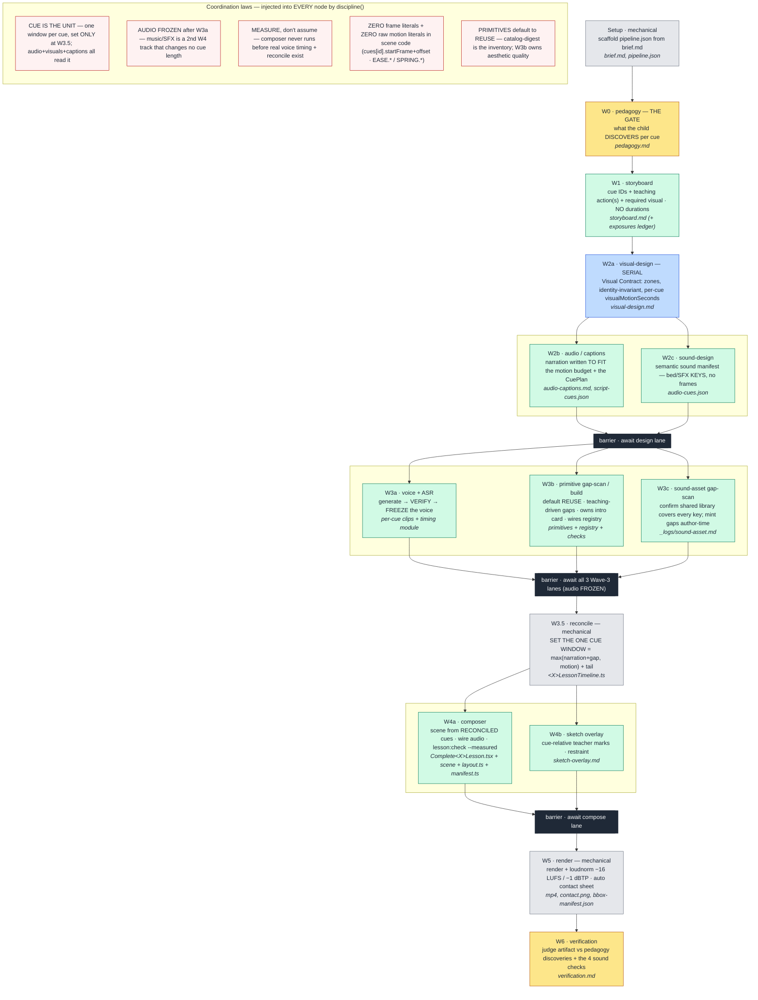

# Skill-system map — animation-test

_The diagnostic context surface. Generated by the `hermes-skill-system` skill (INIT), 2026-06-08. Free-form, no scores, no fixed schema — notes encouraged. Refresh whenever the system's shape changes; append to the Diagnostics log as you fix things so this map gets **more certain** with every run._

**How to read it:** to diagnose a flaw, read the **user-surface problem** + this map (composition + responsibilities) + the **run's real evidence** (see Runtime observability) together. That triangulation gives the top candidate to fix. Prefer fixing the **chain** (the orchestrator) over a single skill when the flaw is coordination/hand-off.

**Sibling fixture — `.agents/skill-system-criteria.md`:** the per-node OUTPUT ACCEPTANCE CRITERIA (the human-judged quality bar for each producing node's artifact; the standard we judge runs against to converge on quality, and the improvement target we sharpen as the system matures). Generated by the `node-output-criteria` workflow; a JUDGING fixture, **NEVER injected into a node's prompt** (that would teach-to-the-test and void the clean-room signal). Edit it when our expectation of a node's output shape changes (richer shape, more data, a new must-have). Pairs with the mechanical Output Contract (`contract()` in `lesson-build.js`, existence + lane) and this map (composition + diagnostics).

---

## Orchestration (the chain)
- **`.claude/workflows/lesson-build.js`** — THE orchestrator (dev). One self-contained loop, one lesson per run (`args.lessonId`), runnable in parallel. Owns wave order, the parallel/serial lanes, preflight, and the shared **`discipline()`** preamble that injects the CLAUDE.md laws into *every* node. Its own rule: *"improve a wave by editing its SKILL; improve the chain by editing this file."* **Fix coordination/ordering/hand-off here, not in a skill.**
- **`.claude/workflows/capability-gap-filler.js`** — separate workflow: library-wide capability factory (proactive, not per-lesson). Skill: `capability-gap-filler`.
- **`pi-runner/`** — PRODUCTION executor. Does NOT redefine the waves — `pi-runner/extract.mjs` *executes* `lesson-build.js` under recording stubs to derive identical prompts + DAG. So **`lesson-build.js` is the single source of truth**; never hand-sync pi.

## The wave DAG (nodes · responsibilities · lanes)
_Generated from `.claude/workflows/lesson-build.js` (the source of truth) — the serial backbone, the three parallel lanes (Design / Voice & Assets / Compose), the `parallel()` barriers between phases, and the coordination laws `discipline()` injects into every node. Node colours: 🟨 gate · ⬜ mechanical · 🟦 serial · 🟩 authoring · ⬛ barrier. Refresh this block when the wave order changes (it is the visual twin of the table below)._



## Nodes → responsibility · reads · writes

_**This table is the clickable node index.** GitHub renders the Mermaid above but its nodes are **not** clickable (sandboxed iframe / CSP — even the anchor-tag workaround is gone). So click here instead: **a node name** opens its skill (the craft); **a skill** in Reads opens its `SKILL.md`. **Reads** = the skills/docs that precede the node; **Writes** = the artifacts it emits, which become downstream nodes' inputs (the DAG arrows show that flow). Each node's *what good output looks like* bar is its entry in [`skill-system-criteria.md`](skill-system-criteria.md). Kit skills (shared-narration/3d), mechanical nodes, and generated files have no in-repo skill link._

| Node (wave) | Responsibility (what it's responsible for) | Reads (skills/docs) | Writes (artifacts) |
|---|---|---|---|
| [Setup](skills/complete-video-pipeline/SKILL.md) | make the lesson runnable; scaffold mechanical pipeline.json | [`complete-video-pipeline`](skills/complete-video-pipeline/SKILL.md) | brief.md, pipeline.json |
| [W0 pedagogy](skills/lesson-pedagogy/SKILL.md) | the gate: what the child DISCOVERS per cue | [`lesson-pedagogy`](skills/lesson-pedagogy/SKILL.md) | pedagogy.md |
| [W1 storyboard](skills/lesson-storyboard/SKILL.md) | tag each cue with teaching action(s) → cue IDs + narration-beat intent + required visual; NO durations | [`lesson-storyboard`](skills/lesson-storyboard/SKILL.md), **[`TEACHING-ACTIONS.md`](TEACHING-ACTIONS.md)** | storyboard.md (carries teaching action(s) per cue) |
| [W2a visual-design (SERIAL)](skills/visual-discipline/SKILL.md) | Visual Contract: zones, identity-invariant, per-cue visualMotionSeconds | [`kids-eye`](skills/kids-eye/SKILL.md), [`visual-discipline`](skills/visual-discipline/SKILL.md), [`early-childhood-visual-taste`](skills/early-childhood-visual-taste/SKILL.md), [CAPABILITIES.md](CAPABILITIES.md), (styles) | visual-design.md |
| [W2b audio/captions](skills/lesson-audio-captions/SKILL.md) | narration written TO FIT the motion budget; the CuePlan | [`lesson-audio-captions`](skills/lesson-audio-captions/SKILL.md), `cue-plan-author` (kit) | audio-captions.md, script-cues.json |
| [W2c sound-design](skills/lesson-sound-design/SKILL.md) | semantic sound manifest (bed/sting/SFX **keys**, no frames) | [`lesson-sound-design`](skills/lesson-sound-design/SKILL.md) | audio-cues.json |
| W3a voice+ASR | generate → **VERIFY** → **FREEZE** the voice timing | `tts-voice-direction` (kit), `asr-cue-aligner` (kit) | voice.wav, gemini-voice.json, asr-alignment.json, generated timing modules |
| [W3b primitive gap-scan/build](skills/primitive-builder/SKILL.md) | reuse-or-build primitives (default REUSE); **teaching-driven gap detection** (map move→`requires`→catalog, not off a drawn layout); owns the intro card; owns primitive AESTHETIC quality; wire the registry | **[`primitive-builder`](skills/primitive-builder/SKILL.md)** (its dedicated skill), storyboard (teaching actions), **[`TEACHING-ACTIONS.md`](TEACHING-ACTIONS.md)**, [`visual-discipline`](skills/visual-discipline/SKILL.md), [`kids-eye`](skills/kids-eye/SKILL.md), [CAPABILITIES.md](CAPABILITIES.md), catalog-digest.md, primitive-registry.json | primitive-gap-scan.md, src/shape-primitives/*, registry, primitive-checks/*.png |
| [W3c sound-asset](skills/lesson-sound-design/SKILL.md) | confirm the shared library covers every key; mint gaps author-time | [`lesson-sound-design`](skills/lesson-sound-design/SKILL.md) (asset side), sound kit library | _logs/sound-asset.md |
| W3.5 reconcile | set the ONE cue window; embed the shared timeline (mechanical) | — (narration-kit `reconcileCueTimeline`) | `<X>LessonTimeline.ts` |
| [W4a composer](skills/remotion-lesson-composer/SKILL.md) | build the scene from reconciled cues; wire audio; run `lesson:check --measured` | [`remotion-lesson-composer`](skills/remotion-lesson-composer/SKILL.md), [CAPABILITIES.md](CAPABILITIES.md) | Complete`<X>`Lesson.tsx, scene, layout.ts, manifest.ts |
| [W4b sketch](skills/sketch-explainer-layer/SKILL.md) | hand-drawn teacher marks, cue-relative (restraint) | [`sketch-explainer-layer`](skills/sketch-explainer-layer/SKILL.md) | sketch-overlay.md |
| W5 render | render + loudnorm (−16 LUFS/−1 dBTP); auto contact sheet (mechanical) | — | mp4, contact.png(+json), bbox-manifest.json |
| [W6 verification](skills/lesson-verification/SKILL.md) | judge the artifact vs pedagogy discoveries + the 4 sound checks | [`lesson-verification`](skills/lesson-verification/SKILL.md) | verification.md |

**Off-wave skills (system, not in waves 1–6):** `lesson-debugger` (post-render feedback triage — symptom→wave mapping; loaded only when the human reports an MP4 issue) · `complete-video-pipeline` (orchestrator overview) · `capability-registry-harness` (the drift-gate method) · `capability-gap-filler` (library-wide factory).

## Skills inventory (canonical home per CLAUDE.md "Skill ownership")
- **This repo — `.agents/skills/`:** lesson-pedagogy, lesson-storyboard, kids-eye, visual-discipline, early-childhood-visual-taste, lesson-audio-captions, lesson-sound-design, remotion-lesson-composer, primitive-builder, sketch-explainer-layer, lesson-verification, lesson-debugger, complete-video-pipeline, capability-gap-filler. (Mirrored into `~/.claude/skills/` as symlinks — edit at the target.)
- **Shared kits (owned elsewhere):** `shared-narration/.agents/skills/` → tts-voice-direction, asr-cue-aligner, cue-plan-author · `shared-3d/.agents/skills/` → three-effects-composition, three-effects-registry, three.
- **Global:** transform-workflow-to-pi · **hermes-skill-system** (this method).

## Governing docs & registries (owners too)
- **`CLAUDE.md`** — the constitution: Entry Point, wave order, the **Discipline laws** (cue-as-unit, audio-frozen, measure-don't-assume, zero frame/motion literals, bbox manifest vs `--measured` truth), Skill ownership, Styles, 3D-decorative-only, generated-asset rules. Injected into every node via `discipline()`. **Laws and facts usually belong here, not in a wave skill.**
- **`docs/pipeline-architecture.md`** — timeline-coordination architecture (cue-as-unit, frozen audio, W3.5 reconcile). The "why" behind the laws.
- **`docs/proposals/machine-gated-verification.md`** — the `--measured` gate spec. · **`docs/IMPLEMENTATION-HANDOFF.md`**.
- **Capability registry:** `.agents/CAPABILITIES.md` (hand-authored prose) + `src/capabilities/primitive-registry.json` + generated `catalog-digest.md` (drift-gated, code-as-truth; `npm run registry:check`). The authoritative "what components exist" list. **Generated component sections:** `primitives` (counting/literacy/interaction/sketch/asset families) · `motionComponents` · `fxComponents` · **`lessonComponents`** (the scene-mountable lesson-INFRA surface — `media` audio/caption layers, `transition` decorative-3D handoffs, `style` wrapper — swept from `src/lesson-media/components.ts` + `src/lessons/transitions/index.ts` + `src/styles/components.ts`). Plus generated `motionVocabulary`, membership-gated `styles` (style IDS, distinct from the `style`-family component), manifest-authored `recipes`. The `lessonComponents` sweep makes the registry the COMPLETE component universe so the lesson↔registry gate (`registry:check-lesson`) is allowlist-free at the scene level.
- **Teaching-action registry:** `.agents/TEACHING-ACTIONS.md` — the pedagogical twin of CAPABILITIES.md: the menu of teaching MOVES (what we teach *with*) + each move's `requires` (audio | visual/layout | component). Read by storyboard (tag cues), visual-design + composer (honor `requires`), gap-scan (map move→capability). The layer that makes planning teaching-first instead of layout-first. Reinforcement-move *dosage* is reasoned in `lesson-pedagogy` §8; the *requirement* lives here.

## Runtime observability — where each run leaves evidence (read these to diagnose)
Three tiers (CLAUDE.md "Observability"), cheapest first, plus the products:
1. **Structured returns (tier 1):** every node returns `{node, status, outputArtifacts, summary, issues, pipelineFindings}`; `lesson-build.js` aggregates them. **The union of all `pipelineFindings` = the workflow-improvement backlog** — the first thing to read.
2. **Per-node logs (tier 2):** `remotion-svg-primitives/lesson-data/<id>/_logs/<wave>.md` — INPUTS READ / OUTPUTS WRITTEN / COMMANDS RUN (+exit +key stdout-stderr) / KEY DECISIONS / ISSUES / PIPELINE FINDINGS. Addressable by wave.
3. **Raw transcripts (tier 3):** `agent-<id>.jsonl` per node under the run's transcript dir (Workflow runtime) / pi-runner — every tool call, for exact reproduction.
- **Run status:** `out/<id>/run-status.json` (pi-runner `--debug`; artifact-verified node status).
- **Product artifacts for diagnosis:** `out/<id>/<id>.mp4`, `<id>-contact.png` (+json) — the primary review surface, `bbox-manifest.json` (linear + `measured` collisions, `gatesFailed` incl. the `bbox-binding` gate, LUFS measured on the master MP4), `gemini-voice.json`, `asr-alignment.json`, `primitive-checks/*.png`, `lesson-data/<id>/verification.md`.
- **Boxed review surface (size/collision questions):** `out/<id>/bbox-overlay/f<frame>-bbox.png` — `npm run lesson:bbox -- --config <path> [--frames a,b]` draws each registered element's MEASURED box (SOLID, by zone) + its DECLARED manifest box (DASHED, only when it diverges >8px) with `id·zone·W×H` labels. ALWAYS review a size/collision claim here, never on a bare screenshot; a >8px declared-vs-measured divergence is a manifest bug to FIX, not narrate.
- **Run environment:** all `lesson:*` scripts run under **Node 22** (`remotion-svg-primitives/.nvmrc 22.22.0`, engines `">=20 <24"`); Node ≥24 crashes the Remotion webpack wasm-hash bundle. Use `nvm use` before any `lesson:*` / gallery command.
- **Prior diagnostics on file:** `docs/lesson-build-shakedown-fixlog.md` (first e2e run fix log).

## Per-node post-mortem — node bindings
_The repeatable loop that hardens this pipeline node-by-node. METHOD (portable): `hermes-skill-system` → `references/node-validation-loop.md` (clean-room single-node re-run + independent judge; one node at a time; never inject the criteria fixture). **THREE roles:** the executor (pi/M3) PRODUCES the artifact; Claude SUBAGENTS do the work (diagnosis · apply+commit · independent-judge); the main loop ONLY orchestrates (spawns subagents, triggers the executor, runs the two HITL gates, commits, advances — never reads/judges/edits in its own context). Judge against `.agents/skill-system-criteria.md`. This block is the REPO BINDING the method needs._

**Validation command (per node)** — `--only <node-id>` is the driver's node-range resume (sugar for `--from X --until X`): it substring-matches the slug against the phase title / node label / node-id, runs JUST that stage, and REUSES every frozen upstream node from disk via the resume-preflight (which fails loudly if a skipped node's required artifact is missing). M3 is the pi default, so `--provider/--model` are explicit-but-redundant. Run `--dry-run` first to confirm the stage selection, then drop it:
```
PI_RUNNER_ESCALATE=0 PI_RUNNER_SANDBOX=1 node pi-runner/run.mjs --lesson <id> \
  --only <node-id> --provider minimax --model MiniMax-M3 --debug
```
Back up the bad-run artifact first as `<artifact>.PRE-<NODE>FIX`, written to repo-root `_prior-runs/<id>/` (OUT of every node's read-scope — never inside `lesson-data/<id>/_logs/` or `out/<id>/`, which a clean-room re-run reads). The node reads the *edited* skill by path.

**Node table** (sweep order; `--only <node-id>` slug substring-matches phase/label/id — copy it straight from `node pi-runner/extract.mjs`):

| Node | --only <node-id> | artifact | owner skill(s) |
|---|---|---|---|
| W0 pedagogy | w0-pedagogy | pedagogy.md | lesson-pedagogy |
| W1 storyboard | w1-storyboard | storyboard.md | lesson-storyboard |
| W2a visual-design | w2a-visual-design | visual-design.md | kids-eye, visual-discipline, early-childhood-visual-taste |
| W2b audio/captions | w2b-audio-captions † | audio-captions.md + script-cues.json | lesson-audio-captions (+ cue-plan-author kit) |
| W2c sound-design | w2c-sound-design † | audio-cues.json | lesson-sound-design |
| W3a voice+ASR | w3a-voice-asr ‡ | generated clips/timing + voice-clips.json | tts-voice-direction, asr-cue-aligner (kit) |
| W3b primitive | w3b-primitive-build ‡ | primitive-gap-scan.md (+ primitives) | primitive-builder |
| W3c sound-asset | w3c-sound-asset ‡ | _logs/sound-asset.md (+ assets) | lesson-build.js W3c (sound lane) |
| W3.5 reconcile | w3-5-reconcile | src/lessons/&lt;X&gt;LessonTimeline.ts | lesson-build.js (chain, mechanical) |
| W4a composer | w4a-composer ‡ | scene + layout.ts + manifest.ts + Complete&lt;X&gt; | remotion-lesson-composer |
| W4b sketch | w4b-sketch ‡ | sketch-overlay.md | sketch-explainer-layer |
| W5 render | w5-render | out/&lt;id&gt;/&lt;id&gt;.mp4 + contact.png | lesson-build.js (chain, mechanical) |

† W2b/W2c share the SAME parallel Design stage (after serial W2a) → `--only w2b` runs BOTH of them but REUSES W2a from disk (it is an earlier serial node, not a stage sibling); judge ONLY the target, restore a previously-validated stage sibling if it drifts. ‡ W3a/b/c are one parallel stage, as are W4a/b → `--only <one of them>` re-runs the whole parallel stage but reuses everything before it; judge ONLY the target. **W6 verification is RETIRED** (blind to pixels) — never run it in the sweep.

## Diagnostics log (append-only — makes this map more certain)
_The **product-quality ledger**: one line per skill/workflow edit that changes what the artifact-production pipeline PRODUCES (`date — owner — rule (skillsys <sha>)`). Stewardship-process/method edits and other-repo edits are NOT logged here — `git log` is their record._
- 2026-06-08 — (bootstrap) map created from `lesson-build.js` + CLAUDE.md. No `skillsys` edits yet.
- 2026-06-10 — registry — sweep the lesson-INFRA component barrels (`lesson-media`/`lessons/transitions`/`styles` wrapper) into a new GENERATED `lessonComponents[]` section (7 comps: media=4, transition=2, style=1 → 69 total `.component`), zod-validated + prose-authored, so the registry is the COMPLETE scene-importable component universe and the lesson↔registry gate is allowlist-free at the scene level. (skillsys `3678cf8`) — the RecapSpotlight phantom that hung the composer was the same class: a scene-legit kit layer the gate falsely flagged because it was uncatalogued.
- 2026-06-10 — lesson-build + registry — **the lesson↔registry GATE** (`registry:check-lesson` / `scripts/registry/check-lesson-primitives.mjs`): every component a gap-scan NAMES (JSX opens + reuse-table ids) is diffed against the generated, zod-validated registry `.component` set (the oracle that cannot lie); a name not in it is a GAP, NOT a REUSE. **De-hardcoded set membership** (the user's correction) — no per-case/per-lesson heuristic (NOT "fail if the useWhen has a Chinese string"), so it generalizes to every future lesson + component. Wired into W3b ("REUSE IS MEMBERSHIP, NOT BELIEF" + self-verify) and the W4a composer PREFLIGHT (a flagged name DOES NOT EXIST → do NOT hunt the repo for it — that hunt IS the failure). Gap-scan only (a scene legitimately defines its own non-registry components; a phantom scene import is tsc's job). (skillsys `c6c6849`, `3a6139d`) — root cause: W3b CONFABULATED a catalog REUSE row for `RecapSpotlight` **while the digest was in context**, fabricating a useWhen that baked in the lesson topic, so reading the digest is necessary-but-insufficient — a mechanical diff is the missing gate. Pairs with the `3678cf8` registry-coverage sweep that makes it allowlist-free.
- prior — see `docs/lesson-build-shakedown-fixlog.md` (shakedown diagnostics, first e2e `kp1-hello-greetings`, W6 YELLOW, 2026-06-04).
- prior (not skillsys-tagged) — kp1 flaw 1 (L2 treated differently from L1) + flaw 2b (slideshow rhythm): L2 carve-out + tokenPattern widen + pedagogy §8/§9 reinforcement + storyboard cue-spine, committed `0bccd7a` + `911edf8`.
- 2026-06-08 — teaching-actions (+ lesson-build chain, storyboard, pedagogy §8 xref, CLAUDE.md) — plan teaching MOVES before layout; gap-scan maps move→`requires`→catalog (teaching-driven, not layout-driven). New doc `.agents/TEACHING-ACTIONS.md`. (skillsys `8ac4f64`) — resolves the `teaching-action-vocabulary-gap` open item + kp1 flaw 2a at the source (announce-topic `requires`).
- 2026-06-08 — kids-eye (+ visual-discipline) — generalize occlusion rule: nothing readable is ever occluded, text most of all; both directions; design-time discipline because a fade-in occluder hides from the linear gate. (skillsys `c87c13e`) — kp1 flaw 2a (intro title occluded by cast).
- 2026-06-08 — lesson-pedagogy (+ TEACHING-ACTIONS, audio-captions, visual-discipline) — comprehension time-FLOOR: an acquisition target needs ≥6–10 SPACED exposures + per-item dwell + a ≥3–5s wait-time gap + recap (research-backed: `research/teaching-tempo-pacing-2026-06-08.md`); fixes the "26s should be ~2min" starvation surfaced by the `kptest-greetings-verify` pi run. Total stays emergent — floors are defaults, no hard-coded length. (skillsys `6d79eb1`)
- FOLLOW-UP (code, not skill) — the `--measured` gate should sample the intro title-vs-cast frame and treat text-occlusion as a hard fail; the linear manifest's low-opacity-keyframe blind spot is why kp1's overlay reached W6. Owner: `lesson:check` / `machine-gated-verification.md`. Logged as the next backlog item.
- 2026-06-08 — typed-silence / the gap (kit `@studio/narration-kit` + lesson-pedagogy §8 + TEACHING-ACTIONS + lesson-storyboard + lesson-audio-captions + cue-plan-author + remotion-lesson-composer + lesson-build.js reconcile) — **intentional silence is FIRST-CLASS and TYPED**: kit gains `GapReason` (open union) + `CueGap {seconds, reason}` + `CuePlanItem.gap`; the voice generator's uniform `gapSeconds` scalar becomes a per-cue lookup baked as **zero-cost local silence** (never a TTS call); reconcile UNCHANGED (absorbs the detected WAV silence). Planning: the §8 wait-time stops being a "reconcile follow-up / fake it" hedge and becomes a real `learner-response` gap (echo = its own beat); composer holds a "your turn" affordance; reconcile-node comprehension-floor advisory (reads storyboard `exposures`). Resolves the FOLLOW-UP below. Naming/cost corrections were user-driven (generic `gap`, not `responseGapSeconds`; silence is free). Doc: `docs/pipeline-architecture.md` §10 + v3; proposal `docs/proposals/intentional-silence-timeline.md`. (skillsys `d471f3a`) — REAL validation = pi-agent run on `kptest-greetings-verify` (kit `@studio/narration-kit` is on-disk, NOT git).
- ~~FOLLOW-UP (code, not skill) — the silent **learner-response-gap** as a first-class reconcile timeline beat~~ → **DONE** by the typed-silence work above (baked into the WAV as a `gap`, so reconcile needs no new term; advisory shipped at the reconcile node).
- 2026-06-08 — **v4 CUE-ANCHORED AUDIO** (kit `@studio/narration-kit` types+reconcileClipTimeline+AudioLayer+generate-voice ; lesson `<X>LessonTimeline`/`Complete<X>`/`LessonAudioLayer`/`_padded-cues-extract`/new `lesson-audio-gate.mjs`/`render-complete-lesson` ; skills `lesson-audio-captions`+`cue-plan-author`+`remotion-lesson-composer`+TEACHING-ACTIONS ; `lesson-build.js` laws+W3a/W3.5/W4a ; CLAUDE.md mirror ; `docs/pipeline-architecture.md` v4) — **each cue owns its OWN trimmed voice clip, mounted per-cue (`<Sequence from={cue.start}>`); the continuous WAV is gone.** Resolves the user's two "huge flaws" on `kptest-greetings-verify`: (1) **DESYNC** — the continuous-WAV played the next clip early whenever motion>narration (measured ~5s mid-lesson); per-cue anchoring makes a clip crossing a boundary structurally impossible. (2) **GAP "white noise"** — was a held-vowel DRONE: `I'm…… Sam` ellipsis → Gemini holds the vowel ~5s; banned at source + generator guard + new deterministic **audio gate** (drone+dead-air, auto-run after voice). Also fixes the TTS clip-padding dead-air (clips trimmed) and the contact-sheet narration-marker bug (`source=reconciled`, exact window). Deletes detect-silences + the per-lesson `ASR_CORRECTIONS` hairball. **VALIDATED on real re-TTS'd audio** (skillsys `8d5ce42`): cleaned the 2 ellipsis cues per the new skill → `npm run lesson:voice` (v4 generator) produced 8 trimmed clips (master 36.09s vs the old 52.31s) → **audio gate ✅ PASS** (the 2 former drones 6.1s/4.2s now 0.3s) → re-render 1579f/52.6s → MP4 measured: every cue's clip sits inside its window, the 11–18s drone zone is now speech+silence, the learner gap is silent at 30–34s under the visual hold. Defects 1+2+3 all fixed on the real production path. The full clean-room **pi** rerun (startAt=design) was BLOCKED by qwen looping 1800s on the TRIVIAL `preflight-design` file-existence check (449k tok, 46 tools, thinking varied so REPEAT_KILL missed it) — a pi/qwen flakiness, NOT a v4 issue (it never reached W2a). See the backlog finding below.
- FOLLOW-UP (pi-runner robustness, not product) — `preflight-*` is a pure file-existence check done by an LLM agent; on the cheap qwen coding-plan it can grind to the node-timeout instead of just `ls`-ing. The dev Workflow runtime forbids fs in the script (so it must be an agent there), but the pi driver COULD do mid-start preflight in plain code (fs.existsSync of REQUIRED_PRESENT) before spawning any node — eliminating the flaky-qwen-on-a-trivial-check failure mode. Owner: `pi-runner/run.mjs` (or a driver-side preflight short-circuit). Until then, a clean-room pi rerun may need 1–2 retries past preflight.  → **DONE 2026-06-09 (fcbe124)**: the workflow preflight prompt now emits a DRIVER-PREFLIGHT marker with the abs paths; the pi driver fs-checks them in plain code and resolves the node with NO pi spawn (dev Workflow path unchanged — marker is inert text).
- 2026-06-09 — lesson-pedagogy (+ lesson-storyboard mirror) — BREADTH before depth: the comprehension time-FLOOR is per-target; the key_difficult earns EXTRA practice ON TOP OF, not INSTEAD OF, each co-equal routine's clean model + recap; a final retrieval is a COMPLETE utterance, never a dangling fragment. (skillsys fabda74) — kptest-greetings-verify: the self-intro target got 3 dedicated cues while greet (Hello/Hi) and farewell (Goodbye) got 1 each — the video read as being about one item with the others stapled on.
- 2026-06-11 — lesson-storyboard — FIDELITY ≠ BLIND TRANSCRIPTION: fidelity is to pedagogy's discovery SET + order, not its phrasing. (1) A relation/bond/part–whole/retrieval beat's narration INTENT is the COMPLETE utterance ("name that six splits into one and five"), never a stranded token ("say 一和五") — repaired at W1 even if an upstream draft fragmented it. (2) Ship ONE closing retrieval recap: fold an aggregator+recap that re-present the same full target set into one cue (prompt→wait→reveal-all), keeping two closers only if their retrieval functions are genuinely distinct and made explicit — never two near-identical closers. (skillsys `893e490`) — kptest-fenyuhe-six W1 post-mortem: the storyboard laundered the old pedagogy's backwards fragments ("model the bond 一和五") and shipped reveal-answer + recap as twin closers; fixture red-flag 56. VALIDATED 2026-06-11 by a clean-room M3 W1 re-run on the new pedagogy spine + independent judge = PASS: complete-utterance bonds + the aggregator/recap kept as TWO explicitly-distinct closers (the node cited the new rule back). Refined same day: the bond intent is stated REFERENTIALLY (name the canonical bond both directions) — the literal glyph is pedagogy's + W2b's — keeping W1 in intent-not-copy territory (the judge's one nit).
- 2026-06-11 — kids-eye (§1 + §1.5) + visual-discipline (§1/§4) — SPATIAL CLAIMS MUST CARRY ARITHMETIC, not prose: (1) "disjoint" zones are COMPUTED — the pairwise bbox intersection of every co-present pair must be empty (a question/label zone inside the teaching-object zone is an auto-fail; overlap allowed only between time-disjoint zones, named per cue); (2) a quantified `separation-gap-min` (≥6% short-side) + a fit-check at the DENSEST split cue at delivery resolution, so a split can't render as one blob; (3) occupancy arithmetic measures each axis against ITS OWN length (a horizontal row ÷ 1920, NOT ÷ the 1080 short-side) shown in the contract. (skillsys `99be61f`) — kptest-fenyuhe-six W2a post-mortem: zone-question FULLY inside zone-objects (345600 px²) + "a visible gap" with no floor + "86% of 1080" axis-denominator error; fixture red-flags 81/82/83 — the upstream root of the W4a text-on-dots overlap, the unreadable split gap, and the empty frame.
- 2026-06-11 — lesson-audio-captions — EVERY narration line is a COMPLETE grammatical utterance, never a stranded fragment: a beat teaching a RELATION (part-whole bond, comparison, transformation, question→answer, greeting→reply) must voice every term the relation BINDS, in the direction(s) it teaches — never the bare term(s) with the binding verb dangling; the lone-word carve-out is the special case where the target IS a complete utterance on its own. Predicate is the STRUCTURAL defect class (de-hardcoded on user review: no decompose/recombine/both-directions in the law, no whole+parts+result triad in report-back — those are part-whole-only); the Chinese (六可以分成一和五 / 一和五，分成。 ❌) lives only in the labeled ✅/❌ illustration. + per-cue READ-ALOUD self-check + report-back confirmation line. (skillsys `522cfff`) — kptest-fenyuhe-six W2b: fragments dropping 六 (×4 split / ×3 combine) + bare recap list, captions mirroring; fixture "missing whole/result". W2b twin of W0 a3b38fe + W1 893e490. Generalizes to any language/relation kind.
- 2026-06-09 — lesson-audio-captions (+ storyboard) — a SYNCABLE L2 target leads its cue (spoken onset within ~0.5s of cue start) or gets its OWN short cue; never tail-buried in a carrier sentence. The composer anchors the visual reveal to cue.startFrame and the ASR can't timestamp an embedded L2 word, so a tail target desyncs by seconds. (skillsys ba48de5) — kptest-greetings-verify: Hello/Hi spoken at the end of a 5s Chinese carrier while the wave fired at cue start (~2.5s early).
- 2026-06-09 — lesson-storyboard — the cue spine must (a) BALANCE cues across co-equal routines (mirrors pedagogy breadth) and (b) give a SYNCABLE target its onset at the cue start (own/lead cue). (skillsys db25c53) — kptest-greetings-verify (lopsided spine + tail-buried targets).
- 2026-06-09 — remotion-lesson-composer (+ lesson-verification) — on-screen target strings are a SUBSET of the cue's OWN spoken phrase (derive from script-cues, never re-author from the brief); a learner-response gap holds a LEGIBLE labeled "your turn" affordance (label + pulse + glyph), bare low-opacity glow FORBIDDEN. (skillsys 9820953) — kptest-greetings-verify: a "Hi! I'm… Sam" bubble over "I'm Sam"-only audio + a bare glow that read as awkward dead air.
- 2026-06-09 — lesson-verification — W6 now actively checks (a) on-screen target strings are a subset of each cue's spoken phrase from script-cues.json (catches text-not-equal-audio) and (b) a learner-response gap holds a legible "your turn" affordance, not dead air. (skillsys a7499bf) — kptest-greetings-verify (the two defects W6 silently passed).
- 2026-06-09 — remotion-lesson-composer (+ lesson-build.js `contract()` helper, W3.5 reconcile + W4a composer node contracts) — **generated code must be lint-clean, verified in-lane.** Any node that writes TS/TSX lints its OWN artifacts (`npx eslint <own .ts/.tsx>`) clean before status=ok: PascalCase React components (a lowercase scene component fails react-hooks/rules-of-hooks on useCurrentFrame/useMeasureHook), ESM `import` only (never require()), zero unused imports/vars. Mechanism = opt-in `lint` flag on the shared `contract()` helper (declared-contract-over-reactive-guard); the composer SKILL gains the craft rules + scopes its self-critique lint to its own files (was the unactionable whole-repo `npm run lint`). (skillsys `9fe4de2`) — 6-section pi spawn 2026-06-09: fenyuhe-five/-six/make-ten/whats-your-name left 70 lint errors (lowercase components, require() in timeline, unused vars) that PASSED the existence-only artifact contract and detonated at the W5 whole-repo render gate (`eslint src && tsc`), where one dirty file blocks every lesson. **Validation pending** = fenyuhe-six rerun `--arg startAt=compose`, both gates armed (PI_RUNNER_ESCALATE + PI_RUNNER_CONTRACT_EXT), Node 24. → **VALIDATED 2026-06-10** by the run in the entry below (the composer went `ok` lint-clean, no whole-repo gate detonation).
- **(2026-06-10) VALIDATED LIVE — lesson↔registry gate + OS read-scope sandbox + composer hardening, on a real `kptest-fenyuhe-six --arg startAt=compose` pi run (MiniMax-M3, `--sandbox`, Node 22): the composer node went `ok` (759s, NO timeout) → W5 render.** One run closed THREE pending rerun-decisions (gate `c6c6849`, lint-clean contract `9fe4de2`, sandbox `c330395`). **Shipped this session:** (a) **`RecapSpotlight` built for real** (registered prop-driven primitive in `shape-primitives/interaction.tsx`, `registry:check` green) so the gap-scan REUSE is now TRUE and the gate passes on the UNCHANGED gap-scan — the scene mounts `<RecapSpotlight>` ×5 (the user chose build-for-real over hand-roll). (skillsys `5fd4be5`) (b) **composer SKILL A/B** — replaced "Mirror the existing lesson pattern" (the line that SENT the model to read other lessons) with an INLINE scene/Complete skeleton + explicit no-cross-lesson rule, and added "every audio key is W3c-pre-verified — pass the key, never search node_modules/fs" (the model was `find /`-ing for `SfxLayer`). (skillsys `76b6221`) (c) **`DRIVER-READ-SCOPE` marker on the composer node** — the workflow edit the sandbox awaited since `c330395`. **THE SANDBOX'S FIRST LIVE COMPOSER USE EXPOSED 3 `buildSandboxProfile` SCOPE GAPS the `demo.sh` 6/6 all missed** (fixed in `pi-runner/run.mjs` + the composer-node marker in `lesson-build.js`, skillsys `c29408e`; global template `~/.claude/skills/transform-workflow-to-pi/` synced byte-identical afterward — animation-test `2bef675` + template `59f7b2f`, see the reconcile note below): (1) **cwd-boot EPERM** — `getcwd`/`uv_cwd` needs file-read DATA on the cwd dir ENTRY (metadata insufficient); granted non-recursively `(literal RUN_CWD)` so the dir reads but its subdirs stay denied; (2) **the `-e` `contractExtension`** (`node-contract.ts`, from `PI_RUNNER_CONTRACT_EXT=1`) is outside the repo scope → pi EPERMs loading it and never boots; grant `[contractExtension, extension]` dirs; (3) **THE BIG ONE — `@studio/*` are SYMLINKS to external kit repos** (`shared-narration`/`sound`/`3d`); granting `node_modules` did NOT cover the symlink TARGETS, so `tsc`/`lesson:check`/render EPERM'd `Cannot find module @studio/narration-kit` → fixed with `linkedPkgTargets()` granting each linked pkg's realpath target (verified: `require.resolve('@studio/narration-kit')` resolves under the sandbox). **★ MOST IMPORTANT LESSONS (mark these) ★** ① **DIAGNOSE FROM THE RAW TRANSCRIPT, NEVER GUESS** — I misread a STALE `run-status.json` `tools=0` as "M3 silent-stalled / 0 tool calls" (the `events.jsonl` showed **76**), then wrongly concluded "the composer node is too heavy for M3 / needs decomposition." The truth was in the `submit_result` payload + the bash sequence: the @studio sandbox gap derailed M3 into a ~25-call module-hunt that ate the 1800s budget, then it confabulated a false `ok`. The root-cause fix made it converge first try ("if you spot the right fix everything comes down much smoother" — the user). This is Hermes Law 1. Memory [[diagnose-root-cause-never-guess]]. ② **an OS read-scope must grant the FULL runtime read surface** (process cwd + the `-e` extension + linked-package symlink TARGETS), not just the declared lesson scope; a sandbox that passes a static demo can still break on the first real toolchain invocation. ③ **M3 (the default executor) CAN do the composer node** — the non-convergence was an ENVIRONMENT bug, not a capability wall; never infer "model too weak" from a heartbeat counter. ④ **Provider default = MiniMax-M3, NEVER qwen** (qwen confabulates the phantom AND overflows its 131k window on the composer); pi's native default is `google`, so the model is NAMED at launch — no per-project `.env`/`run.mjs` wiring (a `PI_RUNNER_PROVIDER` env edit was reverted at the user's direction). ⑤ **the retry/escalation RESTARTS a node from scratch**, discarding partial files — disable it (`PI_RUNNER_ESCALATE=0`) for a clean single-attempt validation of a slow node.

- 2026-06-11 — lesson-pedagogy — **acquisition carve-out generalized beyond L2** (§4: naming a memorized fact/bond — including the conserved total of a 合 beat — IS delivery, not leakage; the self-imposed "还是六"/"是六" ban is gone) + the **complete-utterance rule generalized** from the FINAL retrieval to EVERY relation/retrieval beat (name the whole it decomposes; never a stranded token or bare list). (skillsys `a3b38fe`) — kptest-fenyuhe-six post-mortem: backwards fragment narration ("一和五，分成。") that dropped 六 and suppressed conservation. **VALIDATED** by a clean-room MiniMax-M3 W0 re-run + an independent judge: the regenerated pedagogy.md reclassifies the lesson math-acquisition, names the whole ("6可以分成1和5"), voices the conserved total ("1和5合成6"), and uses complete utterances. The re-run also self-corrected the co-equality flaw (deleted the singling-out reveal beat).
- 2026-06-11 — skill-system (infra, NOT product-ledger) — added the per-node **output-criteria fixture** `.agents/skill-system-criteria.md` (12 nodes: purpose + acceptance criteria + red flags), drafted by the `node-output-criteria` workflow; a JUDGING fixture (human eye, never prompt-injected) that complements the mechanical Output Contract and sits beside this map. The practice is encoded in `hermes-skill-system` (INIT seeds it, OPERATE maintains it) + `transform-workflow-to-pi` (created at workflow-adoption). git-log tracked, not a product-quality edit.

- 2026-06-11 — primitive-builder (NEW skill) + lesson-build — extracted W3b's inlined primitive gap-scan/build craft into a dedicated `primitive-builder` SKILL (teaching-driven scan; REUSE-is-membership; build + drift-gated registration protocol; W3-owns-aesthetic-quality test-stills gate; topic-intro-card ownership). Slimmed the W3b workflow prompt to wiring + SKILL pointer (added `SK.primitiveBuilder`). W3b was the lone craft-heavy authoring wave with no skill of its own. (skillsys `009229a`) — `extract.mjs` clean (14 nodes/10 stages, W3b prompt 9062B); behavior unchanged, craft now editable in one canonical home.
- 2026-06-11 — lesson-build (+ lesson-audio-gate.mjs) — W3a FREEZE gate blocks frozen TTS truncation: a NEW 4th `truncation` gate check — per-cue transcript-coverage (expected caption vs the model's transcriptText, tokenized with voice.json's asr.tokenPattern, flag < 0.85 in-order coverage; SKIPs gracefully if a dedicated-TTS model omits transcriptText) OR duration-sanity (seconds-per-token below 0.65× this lesson's OWN cohort-median s/char — self-calibrating, no hard-coded rate; loose 0.18 abs floor as a documented backstop only). The W3a node now FREEZES only when the gate passes INCLUDING zero truncated cues, with a re-roll-up-to-N-then-block-or-justify loop. (skillsys `3f0e365`) — kptest-fenyuhe-six W3a post-mortem: the TTS silently cut 5/9 Mandarin cues mid-phrase and froze them; the gate's 3 prior checks (drone/empty-short/dead-air) were blind to a truncated-but-nonempty clip and matchScore is informational. VALIDATED on the on-disk bad-run clips: flags exactly the truncated set {0,1,4,5,8} (by-transcript) incl. {1,5,8} (by-duration), 0 false positives on the 4 good cues; extract.mjs clean (W3a 11870B, 14 nodes, DAG unchanged).
- 2026-06-11 — lesson-audio-gate.mjs (+ NEW `scripts/asr-clip-coverage.py`) + voice.json — **W3a truncation coverage RE-SOURCED to the generation-INDEPENDENT ASR pass** + adopt the dedicated-TTS model. The `3f0e365` coverage signal read the Gemini **Live** model's per-cue `transcriptText` self-report; switching the kit voice generator to the dedicated-TTS model `gemini-3.1-flash-tts-preview` (cures truncation at the source) DROPS that self-report, so signal (4a) would degrade to duration-only and miss a subtle END-cut on a normal-length clip. ASR runs on the rendered WAV regardless of TTS model, so it is the durable coverage source: the gate now ASRs **each per-cue CLIP WAV directly** (sherpa config from voice.json via the new python sidecar), tokenizes expected-caption vs clip-ASR with the same `asr.tokenPattern`, strips `sil`/`s` ASR filler, and flags coverage COHORT-RELATIVELY (< median×0.8 OR < 0.70 loose abs floor — tuned from the real numbers, NO hard-coded per-lesson value). Precedence: per-clip ASR (`asr-clip`) → asr-alignment.json `asrText` window-excerpt fallback (`asr-align`) → transcriptText corroborator (`transcript`) → SKIP; report gains `coverageSource` + per-cue `asrText`. Duration-sanity (4b) intact; truncated = (4a) OR (4b). voice.json `model` flipped Live→TTS (one field; temperature left unset). (skillsys `2360045`) — kptest-fenyuhe-six W3a: on the bad-run clips per-clip ASR coverage SEPARATES CLEANLY — truncated cues {0,1,4,5,8} top out at 60% coverage, the worst GOOD cue {2,3,6,7} sits at 75%, so a 0.70 floor flags all 5 truncated with ZERO false positives (incl. idx-4 `cue-split-3of3` "三和三，分成"→ASR "三和三" 60%, the subtle end-cut that duration-sanity alone MISSED). The OLD `asr-align` `asrText` source does NOT separate (it's a continuous-WAV window excerpt — good cues 2,6 read 0% coverage), confirming per-clip ASR must be primary; documented + kept only as a degraded fallback. node --check + `eslint src && tsc` clean.
- 2026-06-11 — lesson-audio-gate.mjs (+ lesson-build.js W3a) — **the W3a truncation check is now ADVISORY (NON-BLOCKING).** The gate's `pass` (and `--strict` exit) tracks ONLY the three HARD checks (drone / empty-short / dead-air); the per-cue coverage + s/char signals and the `truncation` JSON block are computed EXACTLY as before but re-labeled `⚠ ADVISORY` (WARN in stdout + `truncationAdvisories` count in audio-gate.json) and DECOUPLED from `pass` — a flagged clip never fails the gate or blocks the freeze. W3a reworded to match: freeze on the 3 hard checks; REVIEW each advisory clip (re-roll only if genuinely cut on a spot-check listen); the dedicated-TTS model is the STRUCTURAL prevention, not the gate. (skillsys `807ad3c`) — the `3f0e365`/`2360045` backstop FALSE-POSITIVED on the cured fenyuhe-six clips (full longer-Mandarin sentences ASR low: `recap` 41% / `routine-reprise` 22% though both 5.7–5.8s full clips) and on kptest-compare-more-fewer Track B (`。target。×3` drill cues skew the s/char cohort-median → normal `coverage:1` cues fall below the relative floor). A noisy backstop blocking a CLEAN render is worse than none. VALIDATED 2026-06-11: re-run on the cured fenyuhe-six clips reports `pass:true` (0 drone / 0 empty-short / 0 dead-air) while STILL printing the truncation advisory for `recap`/`routine-reprise` (canary intact); `node --check` clean; `extract.mjs` 14 nodes/10 stages, DAG unchanged.
- 2026-06-11 — lesson-build (+ lesson-animatic.mjs, _padded-cues-extract.ts) — animatic gate auto-falls-back to a timeline-only animatic (cue cards + per-clip waveforms + clips-fit-windows verdict) when the scene composition isn't registered, so the W3.5 gate no longer always-fails on a fresh lesson; scene-still path preserved verbatim at/after W4 (skillsys `d008715`) — kptest-compare-more-fewer Track B
- 2026-06-11 — lesson-build (+ scripts/lesson-measured.mjs, scripts/_measured-extract.ts) — captionRedundancy gate exempts read-along acquisition cues (emphasis:true AND caption⊆phrase ⇒ exempt:"read-along-target"; genuine label-dup still WARNs) (skillsys `e793be8`) — kptest-compare-more-fewer Track B
- 2026-06-11 — primitive-builder (+ check-lesson-primitives.mjs) — registry:check-lesson resolves bare-kebab citations via the registry id→component map + anti-vacuous guard fails a 0-citations-extracted gap-scan that names primitives + SKILL mandates dual-form kebab-id (`Component`) (skillsys `455ce83`) — kptest-compare-more-fewer Track B
- 2026-06-12 — lesson-build.js contract() + w3-5-reconcile — tier-2 log is a REQUIRED contract artifact (`log:` param → DRIVER-ARTIFACTS; concrete name kills `<wave>.md` drift) (skillsys `afe60bd`)
- 2026-06-12 — lesson-build.js w3-5-reconcile — inline timeline-module skeleton; budget keys = clip-module cue ids; cross-lesson timeline reads banned explicitly (skillsys `6585c5f`)
- 2026-06-12 — measured-gate — collision exemptions = manifest-declared element-id pairs (`LessonManifest.allowedOverlaps`), never blanket zone pairs (skillsys `abd2a15`) — kptest-fenyuhe-six W4a: the labels:objects exemption swallowed the text-on-dots overlap both passes were built to catch; kp1-hello-greetings' formerly-swallowed intro-card∩kid true positives now surface.
- 2026-06-12 — remotion-lesson-composer + lesson-build W4a — can't-render ⇒ `blocked`, never ok-on-JSON (skillsys `6098452`) — the sandbox-EPERM blind self-grade, 2nd identical occurrence. (Enabler: pi-runner sandbox now grants cwd dotenv reads — `a13c696`, process/engine, git-log only.)
- 2026-06-12 — remotion-lesson-composer — gate justifications bind to the failing JSON row (quote id+frame+value verbatim) (skillsys `5e745d5`) — fenyuhe-six justified the wrong element.
- 2026-06-12 — remotion-lesson-composer — temporal identity: one fade-in at first mount, no per-cue opacity re-entrance; manifest opacityAt mirrors the scene (skillsys `47c351f`) — fenyuhe-six dot-blink/empty-frame class.
- 2026-06-12 — remotion-lesson-composer — sketch-overlay numeric specs consumed VERBATIM (a disagreement = flagged pipelineFinding, never a silent substitution); a spec-required manifest marks entry is contract (skillsys `8209321`) — fenyuhe-six underline drew mid-motion from a 105→60 silent substitution.
- 2026-06-12 — render-complete-lesson.mjs (+ lesson-build.js w5-render prompt) — loudnorm single-pass-dynamic → true deterministic 2-pass linear + printed "Loudnorm verified" (input_*); the W5 node reports input_*, NEVER output_* (skillsys `7f8abf3`) — kptest-fenyuhe-six W5: the node had reported output_* (−16.21/−1.00) as the master's loudness while the file measures −16.97 LUFS / −1.77 dBTP (0.03 LU inside the ±1 gate by luck). NOTE: the W6-advisory item 2 claim "final was −16.21, in spec" inherits the misread; true final is −16.97.
- 2026-06-12 — lesson-audio-captions — narration must be warm CHILD-DIRECTED TEACHER REGISTER (speak TO the child, ≥1 guiding question/arc, own-words reverse, VARY every repeated beat = named anti-stamp defect, natural particles), layered ON TOP of completeness; persona baseline + per-lesson brief `**Teacher.**` override; exemplars are SHAPE not copy (skillsys `1e8057e`) — kptest-fenyuhe-six + first-second-third MP4-review feedback: robot 书面语, `六可以分成X和Y。X和Y合成六` stamped ×3, non-Chinese `我们来分六` — root cause: the skill governed which-fact/completeness/ASR/length but had ZERO register rule, and its completeness exemplars + "carry verbatim" manufactured the stamp. Suffix-run pending.
- 2026-06-12 — remotion-lesson-composer (+ narration-kit feat `41d3472` tokenOnsets/stepFramesFromOnsets, OrderedRowSpotlight stepFrames prop, CLAUDE.md Discipline mirror, lesson-build.js chain note) — spoken-enumeration animation steps bind to the measured ASR token onset (cue.tokenOnsets / stepFramesFromOnsets / stepFrames prop), never a fixed step constant or even grid from the cue head; onsets absent → constant fallback + a logged pipelineFinding (skillsys `d34f7d1`) — kptest-first-second-third feedback: counting circle off-by-one (`SWEEP_STEP_FRAMES=48` fired ~1.5s before the word, 6–8× past a child's AV-fusion window); the ASR already measured per-token onsets but reconcile dropped them — "MEASURE don't assume / zero frame literals" at the per-token level. Projection cross-check: count-third onsets 54/92/140f vs the broken grid's 0/48/96. Suffix-run pending.
- 2026-06-14 — kids-eye (§1.6 NEW) + primitive-builder (demoProps step) + capability-gap-filler (demoProps step) + CAPABILITIES.md (§A sizing clause) [+ gallery code: `PreviewComposition.tsx` two-mode fit/size, `demoProps.tsx` `unit` field + composite scale-wrapper removal, `render-previews.mjs`/`build-gallery-data.mjs`/`gallery/index.html`; registry: `schema.ts`/`build-registry.mjs` `footprint` field removed] — **a component's DEFAULT size IS its "good size," and the gallery's true-size view verifies it honestly.** The story: last session added a per-instance `footprint`-driven "true-size-in-1280×720" overlay + a 45% "stress" view + coral legibility warning tags; the footprints were the bare design unit (countable-object 96×96), so the sim showed specks + fired FALSE warnings. FIRST WRONG FIX (this session, reverted): I deleted the simulation and scaled every demo to FILL its cell — which made a small `label-callout` and a big `place-value-mat` look identical (destroys relative size) and removed the only way to read on-canvas size. CORRECT FIX (user-steered: "without a simulation how can we know the size on the canvas?"): RESTORE the true-size view, accurate by construction — it renders the component at its **real DEFAULT size** (no parallel `footprint` number; that field + zod schema are deleted) 1:1 inside the to-scale 1280×720 frame: a `unit` (one instance, new `demoProps.unit`) + the typical group for an atom, the focal `render()` for a composite (composite demo `scale(0.4–0.8)` thumbnail-hacks removed so 1:1 = real). Clean frame outline only — no safe-area dashes, no stress view, no warning tags. Grid thumbnail stays scale-to-FILL for browsing. **Too-small handling (user directive): detect at true size → RAISE the component's default + re-render → human does final eye**, never flag-and-leave. Standard home = `CAPABILITIES.md` §A (the doc checked at creation) + kids-eye §1.6 (both builders load it) fired at each demoProps step. (skillsys PENDING — commit HELD for user gallery review + the component-default bumps) — user feedback 2026-06-14: "too small … no overlay, no small tags" then "why did you remove the simulation?". VALIDATION so far: re-rendered all 62 previews (Node 22), `registry:check` GREEN, `tsc` clean; size views confirm unit+group (countable-object), focal composites (abstraction-ladder ~83% width), and surface too-small defaults (unit-block size=32). OPEN: bump too-small component defaults (unit-block etc.) with user's final-eye review.

- 2026-06-14 — registry + catalog-digest + families + kids-eye + gallery (PROOF BATCH, **UNCOMMITTED — pending human review**) — **the capability registry redesigned for a read-the-whole-catalog-and-compose model + a coordinated sizing standard.** Two clean-room EXA-validated briefs (`research/registry-exposure-and-taxonomy-2026-06-14.md`, `remotion-svg-primitives/research/gallery-sizing-standard-2026-06-14.md`) drove four changes: (1) **EXPOSURE** — `catalog-digest.mjs` now leads with `intent` as a hand-authored selection SENTENCE (was invisible keyword tags), newly exposes `avoidWhen` ("not for X; use `<sibling>`") on live rows, hides `source`, and fixes the `;`-split that truncated half the menu — root cause: the composing model picked on a truncated half-sentence with the two best disambiguators hidden → sibling wrong-picks + duplicate-builds (`primitive-builder` reads the digest as its ONLY inventory). (2) **TAXONOMY** — new `specialComponents[]` COMPOSITE tier (ATOM→MODIFIER→COMPOSITE→INFRA); 10 composites routed out of `motionComponents` via the shared `MOTION_COMPOSITES` set in `families.mjs` (no file moves; reversible), closing the unmodeled-tier gap `capability-gap-filler` already referenced. (3) **SIZING** — `theme.ts sizing` 36px legibility floor (=5% frame height) + a `footprint{designW,designH,minFontPx,scalable}` registry field; **kids-eye SKILL wrong-canvas bug fixed (1920×1080 → 1280×720, all %-minimums re-derived)**. (4) **GALLERY** — honest preview (animate only gifs that TRULY move; the "live" badge was on 43 static 45-identical-frame gifs) + a big click-to-open **true-size lightbox** (component at its `footprint` inside the 1280×720 frame + a 45%-stress view flagging sub-36px text). Counting (20 atoms) re-authored by a sub-agent as the EXEMPLAR; remaining categories sweep via the §7 parallel-author / serial-merge contract (task #7). **Directly addresses the parked flaw-B "VISUAL component-library audit" below.** Gate green (`registry:check` 70/70 documented). Validation = the human eye on the gallery + digest (this review), then the clean-room sweep.

- 2026-06-16 — remotion-lesson-composer (skill rule) + CLAUDE.md (NEW Discipline law) + measured-gate/`lesson:bbox` (verification mechanism) — **BOUNDING BOX = TRUE FOOTPRINT; decoration NEVER inside a measured `<g>`.** Three hygiene laws so each element's getBBox equals its true footprint: (1) a `measureProps(id)` `<g>` wraps ONLY the load-bearing teaching mark — pulse/attention rings, glow, sparkle, Breathe/shimmer live OUTSIDE as their own `zone:"decoration"` element; (2) decoration is subordinate and must never sit on/cross a teaching mark (the decoration zone-exemption is for real backgrounds, NOT a license to park a ring on the dots — cut it); (3) scene measure-id ≡ manifest element-id is a BIJECTION (both directions). New mechanisms: **`lesson:bbox`** (`scripts/lesson-bbox-overlay.mjs`) draws each element's MEASURED box (solid, by zone) + DECLARED manifest box (dashed when >8px divergent) with `id·zone·W×H` labels → every still shown to a human carries its boxes; the **`bbox-binding` gate** (`lesson-measured.mjs`) turns the silent `?? "decoration"` join-default into a loud WARN, catching decoration-in-measured-group AND scene↔manifest id mismatch. (skillsys `36b27c5` rule + CLAUDE.md law; mechanism `edc27be` overlay + binding gate + LUFS-now-on-master-MP4 fix + Node-24-proof `lesson:check`; proof `2017eb0`) — kptest-fenyuhe-six: a pulse ring inside the `labels` group measured `aggregator-prompt` at 516×400 → phantom labels∩objects collision with dots that never touched anything; one `recap` tag vs three `recap-beat-*` manifest ids fell through to decoration → recap collision detection silently void. Both invisible until the boxes were drawn. **VALIDATED 2026-06-16** by the boxed before/after stills (`out/kptest-fenyuhe-six/bbox-overlay/f1258-{before,after}.png` + `f1521-*`): applying the rules took overlap-measured 6→0 and bbox-binding WARN→PASS; `aggregator-prompt` 516×400→613×70 (ring out of group), recap beats wrong-218×218-square→true-298×28-dot-row. **Verify-intent:** a fresh composer run keeps every pulse/glow/sparkle OUTSIDE every measured `<g>` and declares one manifest id per measureProps id (bijection); `lesson:bbox` shows declared≈measured (≤8px) and `bbox-binding` PASSes — confirmed by the human eye on the boxed still, never a bare screenshot. Also partially encodes **flaw-B**'s "scene ring on the dots" sub-item (the cut ring was exactly a Bucket-3 decorative-no-referent). **LEFTOVERS** (NOT bbox; same gate-fidelity class as the LUFS-on-wrong-file bug): contrast 1/3 measures a ~0-opacity fading bond-glyph @809 (a ghost → skip near-invisible elements, one threshold) + caption-redundancy 6/6 (captions verbatim-mirror narration → a W2b content call). **Node fact:** webpack wasm-hash crashes every `npx remotion` CLI bundle on Node ≥24 → `.nvmrc 22.22.0` + engines `">=20 <24"`; run all `lesson:*` under Node 22.
- 2026-06-16 — RECONCILE (the two 2026-06-14 gallery/sizing entries above) — they LANDED in `f591cd8` (feat gallery+layout, 2026-06-16): true-size preview restored from the real DEFAULT size + `footprint` field/zod removed; `specialComponents[]` COMPOSITE tier + catalog-digest intent-leading present in `src/capabilities/`; auto-size-to-zone helper at `src/layout/fitToZone.ts` + `theme.sizing` constants + composer "ZERO SIZE LITERALS" rule (verified on disk). Their "PENDING/UNCOMMITTED — pending human review" markers are now stale → treat as committed. OPEN still: bump any remaining too-small component defaults with the user's final eye.

### RUN STATUS — post-render FEEDBACK sweep (kptest-first-second-third + fenyuhe-six MP4 review) · 2026-06-12 (read this first next session)

The fenyuhe closing suffix run COMPLETED (MP4 on disk, −16.11 LUFS); the user then reviewed BOTH MP4s and reported 4 flaws. Each was diagnosed by a blind deep-dive agent + external research (briefs in `research/skill-evolution/flow{A,B,C,D}-2026-06-12.md`). **A + D landed (committed); B is parked for a VISUAL component-library audit (the gallery now exists as the surface); validation of A+D moves to PI-RUNNER, not the Claude Workflow.**

| Flaw | Owner | Status | Evidence |
|---|---|---|---|
| **A** robotic narration | lesson-audio-captions | ✅ LANDED — **validate via pi-runner** | `skillsys 1e8057e` — `## Register` section + persona + anti-stamp; criteria W2b register row |
| **B** meaningless decorative FX (rings/arrows) | visual-discipline + composer + OrderedRowSpotlight default | ⏸ PARKED — **equipped now:** the capability **gallery** (`npm run gallery`) is the visual review surface; user will point out the failing/decorative assets ON the gallery, then we encode the gate | brief `flowB-decoration`. 3-bucket audit: load-bearing (keep) · conditional-signal (sparkle/burst, breathe, pointer-arrow — decide per-component) · **decorative-no-referent = cut/deprecate** (`pulse-circle`, `glow-pulse`, `glint-flash`, `shine-sweep` + `OrderedRowSpotlight.tsx:171` arrow default + scene ring decorations). Live proof it recurs: a fresh W2a agent this session still reused pulse-circle/glow-pulse/sparkle-burst. |
| **C** Hermes routing (no-hardcode encoding) | (method) | ✅ DONE | brief `flowC-hermes` — drove the B→A→D sequencing + structural flags |
| **D** counting off-by-one | remotion-lesson-composer + narration-kit | ✅ LANDED — **validate via pi-runner** | `feat 41d3472` + `skillsys d34f7d1`; criteria W4a enumeration-sync row |

**Capability GALLERY shipped this session** (`feat`, tracked by git-log): `npm run gallery` → `http://localhost:4317` — functionality-first (`useWhen`), tag-filterable (`intent`), with **live per-component rendered previews** (62/62 demoed components: poster + hover-loop, from `demoProps`; +90 live IconAssets). Thin view over `primitive-registry.json`, zero new data model. Source = `gallery/index.html` + `scripts/gallery/*` + `src/component-gallery/Preview{Composition,Root}.tsx`; derived `gallery-data.json` + `gallery/previews/` are gitignored (`npm run gallery:previews` regenerates). Now wired into CLAUDE.md Dev as the canonical library browse/audit surface. **This is the surface for the B audit next session.**

**🎯 NEXT (in order):**
1. **B audit on the gallery (with the user):** open `npm run gallery`, the user flags each asset/animation that is decorative-with-no-meaning or used outside a real pedagogy pattern → we lock deprecate-vs-delete for the Bucket-3 set + decide the Bucket-2 conditionals, then encode ONE generalizable "every element earns a discovery + a 5yo-legible meaning, default = no decoration" gate via Hermes (visual-discipline + composer self-grade + flip the `OrderedRowSpotlight` arrow default). NEVER hardcode "remove this ring from this lesson."
2. **Validate A+D via PI-RUNNER** (production executor, MiniMax-M3) on `kptest-first-second-third` — `node pi-runner/run.mjs --lesson kptest-first-second-third --until <wave> --debug` (re-rolls TTS with the warm script + regenerates the counting scene on the onset capability; judge the MP4 by eye+ear). **Do NOT use the Claude `Workflow` tool for this** — this session launched it (`startAt=design`, run `wf_edcadf5d-b7c`) and the user explicitly killed it: production validation goes through pi-runner. The lesson's existing 12:xx inputs are intact and untouched.
3. Apply the same A/D benefit to fenyuhe on its next run.

**Session technique notes (2026-06-12, for reuse):** (a) post-render feedback → **4 parallel BLIND deep-dive agents** (artifact + upstream only, never the prior diagnoses) each doing repo root-cause + external research (Mayer coherence / seductive-details for decoration; child-directed-speech / 凯叔/Freddish for register; AV-sync-window for counting) → routed through Hermes; briefs persisted under `research/skill-evolution/`. (b) **The gallery as a standing visual review surface** for the library — built once, reused every audit. (c) Decoration framed as a **3-bucket meaning audit**, not a per-lesson patch.

### RUN STATUS — kptest-fenyuhe-six post-mortem sweep · updated 2026-06-12 (superseded above; kept for the per-node ledger)

**Sweep status — node-by-node (🎯 = next; full detail in the bullets below):**

| Node | Status | Evidence |
|---|---|---|
| W0 pedagogy | ✅ DONE | `a3b38fe` — acquisition carve-out + complete-utterance |
| W1 storyboard | ✅ DONE | `893e490`/`c089d71` — referential complete-utterance bond; one recap |
| W2a visual-design | ✅ DONE | `99be61f` — arithmetic zones · ⚠ latent dimension bug (zones 1920×1080 vs the 1280×720 rig), parked |
| W2b audio-captions | ✅ DONE | `522cfff` — complete-utterance for every relation/retrieval beat |
| W2c sound-design | ✅ CLEAN | diagnosis + blind judge PASS, no edit |
| W3a voice+ASR | ✅ DONE | Live-model misuse → dedicated-TTS cure `50776dc` (kit) + advisory gate `807ad3c` + ASR re-source `2360045` |
| W3b primitive | ✅ CLEAN | flaw already closed by the membership gate (`c6c6849`/`009229a`) |
| W3.5 reconcile | ✅ edits landed (P1 contract-log, P2 skeleton) — suffix-run pending | `afe60bd` / `6585c5f` |
| W4a composer | ✅ edits landed (P3 gate-pairs, P4 blocked-on-no-stills, P5 quote-row, P6 temporal-identity, E5 verbatim-onsets) — suffix-run pending | `abd2a15` / `6098452` / `5e745d5` / `47c351f` / `8209321` (+ enabler `a13c696` sandbox dotenv) |
| W4b sketch | ✅ CLEAN (stale-only; craft validated) — fixture exemplars added | `f24379c` (no skill edit) |
| W5 render | ✅ edit landed (P7 true 2-pass loudnorm) — suffix-run pending | `7f8abf3` |
| **🎯 NEXT** | **closing suffix run w3-5-reconcile→w5-render** | sweep edits all landed 2026-06-12; the suffix re-validates them on the cured 6-cue clips |

**Side-tracks done this session:** Track B generalization run (`kptest-compare-more-fewer`) = PASS + 3-tier observability landed + 9-cluster backlog synthesized; 3 broken gates fixed+pushed (`d008715` animatic-fallback, `e793be8` captionRedundancy-read-along, `455ce83` registry-bare-kebab). **After the sweep:** closing full setup→W5 run · revisit parked W2a-83 + the W2a dimension bug · the Track B backlog (top: hybrid lesson-kind, triad-expansion, zone-dimension-independence, W6-no-ear).

### Sweep narrative (full detail) — last validated 2026-06-08

- **★ IN PROGRESS (2026-06-11) — PER-NODE QUALITY POST-MORTEM of `kptest-fenyuhe-six`** (the W6-GREEN-but-bad-MP4 run). **Loop discipline:** human = the eye; go node-by-node; fix each flawed node's SKILL durably (NEVER patch the one lesson); validate by a clean-room **MiniMax-M3** re-run of that node + an independent judge; judge output against `.agents/skill-system-criteria.md`; only then advance. **W6 verification is RETIRED for this pass** — it is blind to pixels (its model can't view PNGs, it GREEN-stamped the bad run from the same JSON the measured gate got wrong). Do NOT run or rely on it; we are the eye.
  - **DONE + committed:** (1) **W0 pedagogy** — root cause of the broken script/captions ("一和五，分成。": backwards fragments that drop the whole 六 + suppress conservation). Fixed §4 (acquisition carve-out beyond L2) + §8 (complete-utterance for EVERY relation/retrieval beat). VALIDATED by a clean-room M3 W0 re-run + independent judge. `a3b38fe`. (2) **Criteria fixture** `.agents/skill-system-criteria.md` (12 nodes) — the standing judging bar; `02b4529`. (3) **Criteria-as-fixture practice** in `hermes-skill-system` (seed/maintain) + `transform-workflow-to-pi` (create at adoption) — global-skill repos `2e8719b` / `ae1ab39`. (4) **`primitive-builder` skill extracted** from the inlined W3b craft; `009229a`. (5) **W1 storyboard** — fidelity ≠ blind transcription (complete-utterance bond intent, stated referentially; ONE retrieval recap, not twin closers); VALIDATED clean-room M3 W1 re-run + independent judge = PASS (the node cited the new recap rule back); `893e490` + referential clarification `c089d71`. (6) **W2a visual-design** — spatial claims must carry arithmetic (computed-disjoint zones + `separation-gap-min` + correct-denominator occupancy); VALIDATED clean-room M3 + judge, red-flags 81/82 CLEAR + 83's axis-error fixed; `99be61f`. (7) **pi default → MiniMax-M3** (the config had lagged the map's recorded intent); `cd00cff`. (8) **The post-mortem loop is now CRYSTALLIZED** — portable method in `hermes-skill-system/references/node-validation-loop.md` (+ OPERATE pointer); repo binding in the `## Per-node post-mortem — node bindings` section above (now `--only <node-id>` resume + node table + sweep-order). (9) **W2b audio/captions** — complete-utterance for every relation/retrieval beat (de-hardcoded structural defect class); VALIDATED clean-room M3 `--only w2b` re-run + BLIND judge = PASS (6 cues, whole-framed recap, bidirectional bonds); `522cfff`. (10) **node-binding → `--only <node-id>` resume + loop artifacts live at repo-root `_prior-runs/<id>/`** (out of every node's read-scope, so a clean-room re-run can't teach-to-the-fix or thrash on the clutter); hermes loop-doc rule `396d8ee`.
  - **W2b audio/captions — VALIDATED 2026-06-11 (skillsys `522cfff`).** The de-hardcoded `lesson-audio-captions` edit (complete-utterance rule as a general structural defect class — "voice every term the relation BINDS"; Chinese kept only as labeled ✅/❌ illustration; + per-cue read-aloud self-check + report-back confirmation) PASSED a clean-room MiniMax-M3 `--only w2b` re-run on a cleaned dir: the regenerated artifact has 6 cues, a whole-framed recap (`它们合起来，都是六。`), and complete bidirectional bonds. A BLIND independent judge (artifact + fixture + upstream only) returned PASS. The node's `error` status was an M3 termination timeout AFTER the complete artifact was written, NOT a skill failure. Validated artifacts preserved at `_prior-runs/kptest-fenyuhe-six/audio-captions.VALIDATED.md` / `script-cues.VALIDATED.json`.
  - **W2c sound-design — CLEAN, no edit (2026-06-11).** Clean-room DIAGNOSIS (CLEAN) + a FRESH independent BLIND judge (PASS, no nits) both passed the current `audio-cues.json` (regenerated by the `--only w2b` stage-sibling re-run from the validated upstream + current `lesson-sound-design` skill) on every W2c fixture criterion: semantic SFX→beat map keyed to REAL storyboard cue IDs (single `ta-da` on the climax `split-3-and-3`, `chime` on `recap`), correct `toneSafe:false` (math-acquisition, not tone-discrimination), library-resolved keys, complete companion log. No skill flaw → no diff. (An *optional* toneSafe clarifying gloss was judged not-worth-it; the rule is already unambiguous.) **PARKED (→ W3b/W3c stage):** the W3c `_logs/sound-asset.md` is STALE — it provisions superseded cue keys (`cue-reveal-answer`, 6×`pop`+3×`tick`) absent from the current 2-row manifest; surface it when the Wave-3 parallel stage is diagnosed.
  - **W3a voice+ASR — DEFER → chain+gate-code fix IN PROGRESS (2026-06-11).** Clean-room diagnosis: the kit voice/ASR CRAFT held (good Aoede/Mandarin direction; ASR genuinely run; the node HONESTLY detected + filed the defect as pipelineFinding P1; clips trimmed; v4 freeze invariants intact — per-cue clips, no continuous WAV, no PADDED_CUE_DURATIONS). The REAL defect: **5/9 cues were silently TRUNCATED mid-phrase by the TTS and FROZEN** (`一和五，分成。`→`一和五，`; per-cue durations ~0.14s/char vs ~0.30s/char calibrated). Root cause is NOT the kit skills — the **freeze gate has a hole**: `scripts/lesson-audio-gate.mjs` checks only DRONE/EMPTY-SHORT/dead-air (a truncated clip is none of those → passes), and `lesson-build.js` W3a freezes on "matchScore acceptable AND audio-gate pass" where matchScore is explicitly informational. Transcript-vs-script fidelity is READ but never GATES the freeze. **Owner = `lesson-build.js` (chain) + `lesson-audio-gate.mjs` (gate code)** — animation-test ledger, NOT a shared-narration kit edit. **ROOT CAUSE (deep-research, HIGH conf):** Live-model MISUSE — `gemini-3.1-flash-live-preview` (a streaming Live model) used for batch TTS emits a premature `turnComplete` mid-utterance (Google bug #707/#2117, worse for Chinese), aggravated by `temperature:0` (#1578) + a client early-drain (resolve-on-first-turnComplete + immediate `session.close()`). NOT a provider quality ceiling → NOT an ElevenLabs switch. **FIX SHIPPED (3 parts):** (1) **generation cure** — kit `shared-narration/bin/generate-voice.mjs` gains a SELECTABLE dedicated-TTS transport (`-tts` model → `generateContent` single non-streamed payload, no turn-boundary to cut), temperature configurable (default omitted), Live early-drain fixed; selected via `voice.json` model = user-specified `gemini-3.1-flash-tts-preview`; spike + self-test = all 5 truncated cues now FULL (`50776dc` on kit branch `fix/dedicated-tts-transport`; the kit had NO git → baseline `83abe33`+branch, user said KEEP). (2) **detection gate** — `lesson-audio-gate.mjs` 4th truncation check + W3a freeze re-roll-or-justify (`3f0e365`/`9a6a8dc`). (3) **ASR re-source** — dedicated-TTS drops the model self-report, so coverage now comes from a generation-independent per-clip ASR sidecar (`asr-clip-coverage.py`); clean 60%/75% separation on the bad run, catches the subtle end-cut duration missed; voice.json flipped to the TTS model (`2360045`/`33b71c8`). **NO hard-coding (cohort-relative + tokenizer).** **VALIDATION (2026-06-11):** CURE ✅ — re-voiced fenyuhe-six via dedicated-TTS: master 34.1s (was 20.9s truncated), clips 5.7–6.2s / s-char 0.32–0.44 (was 0.14); the truncation class is GONE. GATE ⚠️ FALSE-POSITIVES — the cohort-relative/ASR-coverage design is too fragile: (1) fenyuhe-six `recap`(cov 41%) + `routine-reprise`(cov 22%) flagged though FULL (small Mandarin ASR mis-transcribes long sentences → coverage FP); (2) Track B flagged 4 cues with coverage:1 (the `。target。×3` drill cues inflate the duration cohort-median → normal cues fall below the relative floor → duration FP). **RESOLVED — user chose ADVISORY-ONLY:** the truncation check is decoupled from the gate `pass` (only the 3 HARD checks — drone/empty-short/dead-air — gate; truncation prints a non-blocking ⚠ advisory canary). The dedicated-TTS cure is the structural fix, so a noisy ASR/cohort backstop must not block a clean render. Re-validated: fenyuhe-six `lesson:audio-gate` → `pass:true` with the advisory still printed on `recap`/`routine-reprise` (`807ad3c`/`71daa79`). **W3a NODE DONE.** (Note: stale OLD-cue-id clips remain in the clips dir alongside the 6 new — harmless clutter, gate reads voice-clips.json manifest; kit `generate-voice` could clean the dir — minor finding. The W3a chain-prompt freeze discipline on the cheap M3 executor will be exercised in the closing full run.)
  - **PARALLEL — Track B generalization+observability run (2026-06-11):** a FULL `lesson-build` Workflow (Claude Code executor, NOT pi/M3) launched on a brand-NEW topic `kptest-compare-more-fewer` (Chinese early-math MORE/FEWER comparison — 五比三多 / 三比五少, a *different relation kind* than 分与合 on purpose) to (a) test that the W0–W2c edits generalize to a fresh lesson + relation, and (b) shake down the 3-tier observability (structured returns + per-node `_logs/` + raw transcripts). Run ID `wf_5bd3bd11-17e`. **COMPLETED** (setup→W6, ~46min, 14 agents): produced pedagogy (declared a HYBRID math-insight+acquisition kind for the 比-comparison), 11-cue storyboard, visual-design, …, MP4 + verification.md. Under independent assessment — does it confirm the W0–W2c edits generalized, and did the 3 observability tiers + recording land cleanly. NOTE: launched BEFORE the W3a truncation fix, so its workflow snapshot lacks the freeze gate; its W3a voice may or may not have used the flipped TTS model depending on timing — a known caveat for that run's audio.
  - **W3b primitive — CLEAN (2026-06-11).** The fenyuhe-six artifact DID confabulate the `RecapSpotlight` REUSE row (topic-baked useWhen, no scan-time catalog entry) — but the root-cause fix already shipped: the lesson↔registry MEMBERSHIP gate (`c6c6849`) + `primitive-builder` "REUSE is membership, not belief" (`009229a`); diagnosis verified the gate is airtight (passes real, hard-fails an injected phantom). No new edit.
  - **TRACK B DEEP-ANALYSIS (2026-06-11) — the content discipline GENERALIZES; the open weak point is the VERIFICATION layer + un-codified relational patterns.** 6 clusters from ~28 findings: **(A)** gates false-positive on legit design intent (captionRedundancy on read-along, audio-gate cohort-skew/ASR-window-bleed residual, contrast on transient tags); **(B)** gates mis-placed/can't run at boundary (★ animatic gate ALWAYS-FAILS-FRESH at W3.5 — renders a W4-registered scene; scaffold omits timeline/clips paths); **(C)** planning skills under-specify reusable relational patterns re-derived each run (★ hybrid "math-insight+acquisition-named-result" lesson-kind; model→echo→replay triad; phrase-as-target; toneSafe; wait-time; motion-budget) — highest leverage for the cheap pi executor; **(D)** coordinate-space coupling (★ zones authored 1920×1080 vs the 1280×720 rig → SILENT rescale — retroactively means the `99be61f` W2a arithmetic-zones proofs were computed in the WRONG space; layout.ts barrel drags Remotion into the pure-TS manifest harness; @studio remotion peerDep); **(E)** W6 has NO EAR (sound checks unverifiable from a still — silently skipped) + contract-token drift (star-vs-dot) reaches W6 unflagged; **(F)** schema gaps (popin per-entrance, sketch onset to named motion-event). Standalones: ★ registry:check-lesson VACUOUS-PASS on bare-kebab citations (gate silently verifies nothing); per-clip matchScore audit; W3c machine preflight. Top backlog: animatic-dead-fresh · captionRedundancy-FP · bare-kebab-vacuous-pass · hybrid-lesson-kind · triad-expansion · zone-dimension-independence. Two STRUCTURAL/human items: W6-no-ear (machine duck-measure vs human-playback handoff) + the star-vs-dot taste call. This is the workflow-improvement backlog AFTER the current sweep.
  - **THEN sweep (resume at W3a — W2c DONE CLEAN):** W3a voice+ASR (truncation-gate fix in progress) → W3b primitive → W3.5 reconcile → W4a composer (text-on-dots overlap + unreadable split-gap + blind self-grade — the big one) → W4b sketch → W5 render. **Execution is ORCHESTRATOR-DRIVEN** (3 roles — see the node-bindings block): the main loop ONLY spawns subagents / triggers the executor / runs the gates / commits / advances; it never reads-judges-or-edits in its own context. Method = hermes `references/node-validation-loop.md`; judge vs the criteria fixture; W6 retired. After the sweep, one full clean-room run from `setup` is the closing validation; then revisit parked W2a-83. Bad-run artifacts + post-mortem proposals are backed up to repo-root `_prior-runs/<id>/` (OUT of every node's read-scope), never inside the lesson dir.
  - **PARKED for post-run review:** **W2a red-flag 83** — a single-row 6-dot metaphor occupies only ~12% of the non-binding (vertical) axis. Accepted as-is (user: never an issue in final renders; the axis-denominator error that *hid* it is fixed). Revisit after the full run whether `visual-discipline` §4 should explicitly bless-and-constrain the single-row exception (ship target size + vertical-center) vs leave it to per-lesson judgment.
  - **Parked (2026-06-12 diagnoses)** — deduped against the items already recorded above; owners named:
    - **W2b / cue-plan-author** — pick ONE convention for echo/wait-beat dwell: typed `gap` on the carrying cue (fenyuhe-six) vs its OWN cue (greetings-verify) — two conventions now exist in the wild; state the fold rule where W2b owns it (whether each gap's seconds ≥ the folded row's intended dwell is W2b's contract to state).
    - **W3a steward** — refresh/append `_logs/w3a-voice-asr.md` on voice regeneration: it still describes the pre-fix Live-model truncated state while downstream nodes cite it.
    - **W0/W1 stewards** — exposure-floor shortfall (一和五:3, 二和四:3, 三和三:4 vs ≥6–10); the W3.5 advisory fired correctly — the spine is under the floor.
    - **chain (lesson-build.js W5)** — two cosmetic chain debts to fold into the next chain edit: `render-timing.json` is a JSON parked in the tier-2 `_logs/` dir (not a wave-named .md), and the W5 INPUT line cites the QA-only master WAV as "the frozen voice" (v4 truth = the per-cue clips).
    - **chain / pi-env** — the webpack wasm-hash workaround lives only in gitignored `out/<id>/w5-patch-wasm-hash.cjs`, so every clean run re-derives it; decide promotion to `scripts/` vs a Node-version pin (and re-check the log's "reproduces on Node 22.12" claim — W4a bundled fine hours earlier).
    - **kit `@studio/narration-kit` CaptionLayer** — cue-boundary crossfade (FADE_FRAMES=6) garbles two opaque caption cards on top of each other; sequential out-then-in for opaque-card themes, or crossfade text only.
    - **W2a dimension bug follow-through (cluster D, already parked)** — when unparked, the composer-side rule is: consume the declared coordinate space VERBATIM; any space conversion is a FLAGGED pipelineFinding, never a silent layout.ts comment (the M3 composer silently absorbed ×2/3 — silently rescaling every rig-space gate floor with it).
    - **ZoneName** — optionally add a semantic `prompt` zone later; E1's element-id pairs already make zone tags exemption-irrelevant.
    - **captionRedundancy residual** — the unused `labelWindows` mechanism on `LessonCaptionLayer` is the composer-side tool if W2a ever rules the ribbon redundant under an in-canvas label; design call.
    - **W3b / catalog** — primitives could declare per-primitive ANCHOR EXPORTS in the catalog-digest: the sketch spec's named anchor ids (`kp6-cluster-left-bottom-left/right`) were a polite fiction the composer re-resolved from layout constants.
    - **contact-sheet tooling** — the 5 per-cue samples can never land inside a motion window between narr-end and hold-mid; a mid-motion sample (e.g. at the motion-window midpoint when layout.ts exports one) would have shown the mid-motion underline at a glance.
    - **cluster F (schema)** — corroborated with a real defect this run (spec onset 105 → scene 60, mid-motion draw): when the backlog item is taken, add `onsetEvent: <named-motion-event> + offset` and an end-anchored `fadeOutFromEnd` to the sketch schema (chain + SKILL together).
- **OPEN rerun-decision (HITL, low priority):** a live `--worktree` + `--sandbox` COMBINED smoke is still unproven — each half is proven separately (sandbox live on this run; worktree TDZ-hoist via the template), and the byte-identical reconcile (`2bef675`+`59f7b2f`) is static-verified by a 3/3 adversarial Workflow. Run it when convenient; not blocking.
- **W6 advisory backlog (non-blocking gate-definition flaws, surfaced by this run — fix in a Hermes pass):** (1) `captionRedundancy` gate is WRONG for lessons where on-screen text is a SUBSET of the spoken phrase (jaccard=1.0 is design intent, not redundancy) → invert/INFORMATIONAL for that lesson kind; (2) the W4a LUFS WARN measures voice PRE-loudnorm (−17.3) — hide it when W5 loudnorm is scheduled (final was −16.21, in spec); (3) bond-glyph contrast WARN is a single ENTRANCE-frame (~33% opacity) sample — W4a should report HELD-state contrast across entrance/held/exit, not one brittle frame; (4) the Remotion CLI's mandatory `.env.local` read is sandbox-EPERM-fragile → it blocked the contact-sheet/primitive-checks still-render path under `--sandbox` (make `.env.local` optional in the CLI path, or split `lesson:check` so the still-render sub-stage runs unsandboxed).

- **Typed-silence / the gap (`d471f3a`) is VALIDATED END-TO-END.** Full pi-agent run on `kptest-greetings-verify` (qwen3.7-max) ran setup→W6 and produced the final MP4: `out/kptest-greetings-verify/kptest-greetings-verify.mp4` (**54.0s / 1619f @ 30fps, −16.3 LUFS**, reconciled total = 53.97s, inside the 45–60s brief hint). The gap went the whole way: planner authored `gap:{seconds:4,reason:"learner-response"}` on its own `im-learner-gap` cue → baked as REAL zero-cost WAV silence → reconcile absorbed it (math unchanged) → composer + sketch added the "your turn" glow → rendered. **W6 = YELLOW** (teachable arc intact; one gate fail). Per-run detail: `lesson-data/kptest-greetings-verify/verification.md` + `out/kptest-greetings-verify/run-status.json`. The run was resumed `--arg startAt=wave3` (reused W0–W2 — the first-changed-node rule worked).
- **NEXT-SESSION BACKLOG (the flaws — improve these next):**
  - **(system) TTS clip-padding dead-air** — Aoede pads every clip with ~1–4s of silence, so the WAV carries ~16s of unintended silence on top of the one authored 4s gap (e.g. the learner gap reads ~7.8s = 4s authored + 3.8s padding; a 6.3s gap exists where NOTHING was authored). Fix: trim each clip's leading/trailing silence in `@studio/narration-kit` `bin/generate-voice.mjs` BEFORE splicing the authored gap. Owner: narration-kit.
  - **(system) qwen repetition loops on heavy waves** — W2b audio-captions AND W3.5 reconcile each ran a degenerate "same line ×N" loop (171 MB / 143 MB transcripts) AFTER finishing their real work; both recovered but burned minutes and would hit the node-timeout. Fix: a pi-runner watchdog — "same output line repeated N times → kill the node" (the stall detector misses it because events keep flowing). Owner: `pi-runner/run.mjs`. → **REPEAT_KILL shipped earlier; EXTENDED 2026-06-10 (`c330395`)** with two more behavioral kills for the OTHER degenerate classes that REPEAT_KILL misses (thinking varies so deltas don't repeat): **silent-stall kill** (`PI_RUNNER_STALL_TIMEOUT` 300s, gated on no-tool-in-flight so a long bash is exempt) for the model-went-dead-after-a-tool class, and **no-progress tool-thrash kill** (`PI_RUNNER_TOOL_REPEAT_KILL` 5, resets on write/edit) for identical-search-with-zero-writes. Motivated by kptest-fenyuhe-six W4a (MiniMax-M3) burning the full 1800s silent after grepping a phantom component. Memory: [[pi-runner-watchdog-and-sandbox]].
  - **(RESOLVED 2026-06-10 — gate `c6c6849`/`3a6139d` + registry coverage `3678cf8`; Law 4 "contract over reactive guard")** — the composer hung because it was told to use `RecapSpotlight`, a component named in visual-design.md + sketch-overlay.md + the W3b log but **never built, registered, or in `catalog-digest.md`**. The watchdog/sandbox above are REACTIVE GUARDS for the symptom (thrash/over-read); the DURABLE fix is a **declared contract at the W3→W4 boundary**: a preflight that diffs every component id named by visual-design/sketch against `catalog-digest.md` and fails LOUDLY (naming the missing id) before the composer spawns — turning a 30-min silent burn into a 1-second contract breach. Owner: `lesson-build.js` (chain/orchestrator edit) — **product-quality → diagnostics-log + `skillsys` + approval + rerun-decision (suffix from the gap-scan/preflight node)** when built. Likely pairs with a W3b contract that a "may ship X" deferral is resolved to built-or-dropped before W4. **HOW it shipped (the user steered it):** a MEMBERSHIP gate against the zod-validated registry (the `c6c6849`/`3a6139d` entry above), NOT the prose-heuristic originally sketched here, and the registry was extended (`3678cf8`) to the complete universe. **Rerun-decision VALIDATED 2026-06-10:** the `--arg startAt=compose` MiniMax-M3 `--sandbox` run composed `ok` and mounted `<RecapSpotlight>` ×5 from the now-registered primitive (the user chose BUILD-it-for-real, so the gate passes on the unchanged gap-scan and there is no phantom to hunt). See the 2026-06-10 VALIDATED-LIVE entry above.
  - **(RESOLVED 2026-06-09 — worktree) qwen CROSS-CONTAMINATION under shared-tree concurrency.** All N concurrent lessons run in ONE working tree, so a cheap agent can wander into ANOTHER lesson's files: in the 2026-06-09 6-section spawn, `kptest-classroom-objects`'s W2c agent read `kptest-make-ten`'s `audio-cues.json` (as a "reference"), returned a malformed tool_call with no return block, and wrote NOTHING for its own lesson (driver then false-passed it ok — now fixed by 98fcdd3, so it fails loudly instead). Frequency rises with concurrency. Options: (a) per-run git worktree isolation (the dev Workflow's `isolation:'worktree'` analogue — pi-runner has none today); (b) cap/stagger concurrency; (c) accept + rely on resume-on-error now that no-parse fails loudly. Owner: `pi-runner/run.mjs` (+ maybe the `discipline()` SCOPE preamble in `lesson-build.js`). DECIDE before the next big multi-lesson spawn. **UPDATE (2026-06-09, Output Contract):** the SILENT half of this finding is now structurally closed — every producing node declares `DRIVER-ARTIFACTS`/`DRIVER-OWNS` (via the `contract()` helper) and the driver verifies the *required* set independent of the self-report, so a node that writes nothing for its OWN lesson now fails loudly as `blocked` even when it emits a clean return (not only the no-parse case 98fcdd3 covered). A self-reported out-of-lane write is flagged `contract warn`. What stays OPEN is the *physical isolation* that prevents the WANDER itself: hard owns-enforcement needs **per-stage git commits** (`git diff --name-only ⊆ DRIVER-OWNS`); **worktree-per-run** makes it impossible. Still the user's policy call (a/b/c) before the next big spawn — but no longer a silent-failure risk. Spec: `~/.claude/skills/transform-workflow-to-pi/reference/artifact-contract.md`. **RESOLVED (2026-06-09):** user chose (a) worktree + the auto-discovery enabler, both SHIPPED. (1) Lesson registration is now AUTO-DISCOVERED — each Complete*Lesson.tsx exports `lessonComposition`; `scripts/build-lesson-registry.mjs` generates `src/lessons/_lessonRegistry.generated.tsx`; Root.tsx maps it; the composer no longer edits the shared Root.tsx/Composition.tsx (so a lesson's writes are 100% disjoint → conflict-free merge-back, AND a half-built lesson can't break the bundle). (2) pi-runner gains opt-in `--worktree`/`PI_RUNNER_WORKTREE`: per-run git worktree (branch `pi/<id>`), node_modules symlinked, each node's absolute paths rewritten BASE_ROOT→worktree, status/logs kept in main, deliverable copied back, source left on branch for a human-gated merge. Cross-contamination is now PHYSICALLY impossible under `--worktree`, not just caught. Verified: worktree git mechanics + arg plumbing + prompt-rewrite (kit paths untouched); the full isolated pi render awaits a Remotion-compatible Node (this shell's Node 24 breaks webpack's wasm-hash). Specs: `transform-workflow-to-pi/reference/worktree-isolation.md` + `artifact-contract.md`. **2ND MECHANISM (2026-06-10, `c330395`+`3a6d66e`):** worktree prevents *cross-WRITES*; it does NOT stop a node *READING* another lesson (the kptest-fenyuhe-six W4a spelunk that read 3 other lessons' source + bloated context to 116k tok). Opt-in macOS `--sandbox` read-scope makes the prompt READING LAW OS-enforced — a node declaring `DRIVER-READ-SCOPE` runs under `sandbox-exec`; out-of-scope reads → EPERM (kernel-enforced, inherited by child grep/find). Composes WITH worktree (Seatbelt resolves symlinks to target realpath → `buildSandboxProfile` allows node_modules' symlink target; the BASE_ROOT→wtRoot rewrite runs before scope extraction so scope auto-follows the worktree). Mechanism + worktree-compat verified via `sandbox/demo.sh`; live pi-under-sandbox awaits a `DRIVER-READ-SCOPE` marker on the composer node (a workflow edit, needs approval). Memory: [[pi-runner-watchdog-and-sandbox]].
  - **(lesson, from verification.md punch list)** — #1 🔴 `rah-farewell` contrast 2.82:1 < 4.5 (W4a, the one gate FAIL); #4 🟡 recap-2 "I'm" lost to TTS/ASR — visual highlight but no re-voiced audio (W3a); #3 🟡 contact-sheet narration-window markers misaligned for short-narration/long-hold cues like im-slow-model (`scripts/make-contact-sheet.mjs`); #2 🟡 namecard∩rah spacing advisory (W4a `NAMECARD_DROP +20px`).
  - **(RESOLVED 2026-06-09) the user's "couple of very huge flaws"** — specified on the kptest-greetings-verify MP4 and routed: lopsided airtime (self-intro dominated; greet/farewell starved), on-screen text != audio (a "Hi! I'm… Sam" bubble over "I'm Sam" audio), L2 target words not landing on their animation (tail-buried in the Chinese carrier), and an awkward dead-air learner gap. Fixes: pedagogy/storyboard breadth-balance (fabda74/db25c53), audio-captions/storyboard target-leads-cue (ba48de5/db25c53), composer/verification on-screen-subset-of-spoken + legible gap affordance (9820953/a7499bf), + the pi-preflight short-circuit (fcbe124). VALIDATION = 6 ENTIRELY NEW sections (2 English, 2 math, 2 Chinese 分与合) spawned on pi — deliberately NOT a greetings rerun (re-running the same lesson would teach-to-the-test; new sections prove the laws generalize).
- **Process fixes that shipped this session (git log, not product-quality):** pi-runner zero-artifact-node preflight false-block + flaky-status fix (`0d0db8c`), `PI_RUNNER_NODE_TIMEOUT` default 1800 (`c6e30c0`), Hermes "validation rerun = suffix fixed by the first changed node" (`a4b7619`, global skill repo). Memory: `validation-is-the-real-run-not-tests.md`. pi-runner driver-side DRIVER-PREFLIGHT short-circuit (fcbe124); pi-runner forgiving artifact-path resolution — verify a declared artifact at RUN_CWD **or** ROOT, so a real written file is never false-flagged `blocked` when an agent reports a ROOT-relative path (8bb507a — surfaced by the 6-section spawn: make-ten / whats-your-name / fenyuhe-six each false-blocked at a content node though the artifact was on disk; resume-from-furthest-node recovers with zero waste). A clean-exit node with NO return-protocol block now fails LOUDLY as `error` instead of silently passing as `ok` (98fcdd3 — a derailed W2c that wrote nothing was slipping through and only surfacing one node downstream when its consumer couldn't find the input); **paired with** a robust return-block parser (89fe3ac) that recovers a valid return object even when the cheap model botches the ```json fence (unclosed / no lang-tag / bare object), so ONLY a true no-JSON derailment fails — not a mere formatting slip (which W2a-visual-design hit right after 98fcdd3). **Output Contract (the artifact contract)** — the 4th contract layer Claude Code leaves to the orchestrator: each producing node declares its required artifacts + owned paths as data (`contract({artifacts, owns})` in `lesson-build.js`, applied to all 14 nodes), rendered as both Definition-of-Done prose AND `DRIVER-ARTIFACTS`/`DRIVER-OWNS` markers; the generic driver verifies the required set independent of the self-report (`blocked` on a missing required artifact; `contract warn` on a self-reported out-of-lane write). Engine in `pi-runner/run.mjs` (+ byte-identical template sync), law in `transform-workflow-to-pi` SKILL, full spec `transform-workflow-to-pi/reference/artifact-contract.md`, capture-signal note in `hermes-skill-system` law 4. Closes the false-OK *missing-artifact* class the no-return-block fix didn't.
- **(2026-06-10) pi-runner behavioral watchdog + OS read-scope sandbox (`c330395`, `3a6d66e`).** Two more behavioral kills (silent-stall `PI_RUNNER_STALL_TIMEOUT`=300s gated on no-tool-in-flight; no-progress tool-thrash `PI_RUNNER_TOOL_REPEAT_KILL`=5 resets on write/edit) routed through one `killChild`, extending REPEAT_KILL to the silent-death + identical-search-no-write classes. Plus opt-in macOS `--sandbox`/`PI_RUNNER_SANDBOX` read-scope (`sandbox/read-scope.sb` + `DRIVER-READ-SCOPE` marker → `sandbox-exec`) making the READING LAW OS-enforced, worktree-compatible (realpath expand). Default OFF, byte-identical when off; `sandbox/demo.sh` 6/6. Backed by an Exa+Reddit research pass (prompt rules unenforceable on weak models → boundary in the OS + behavioral kill). REMAINING (rerun-decision HITL): a full pi run to see the new kills fire live + the sandbox enforce on a real composer node (needs a `DRIVER-READ-SCOPE` marker = workflow edit). Advances the watchdog + cross-contamination backlog items above. Memory: `pi-runner-watchdog-and-sandbox`. → **DONE 2026-06-10:** the `DRIVER-READ-SCOPE` marker shipped on the composer node and the sandbox ENFORCED on a real composer run — it OS-blocked M3's `find / -name "SfxLayer*"` over-reach (returned nothing). First live use also exposed + fixed 3 `buildSandboxProfile` scope gaps the demo missed (cwd `(literal)` / extension dir / `@studio` `linkedPkgTargets`). See the 2026-06-10 VALIDATED-LIVE entry above. → **BYTE-IDENTICAL RECONCILE 2026-06-10 (animation-test `2bef675` + template `59f7b2f`):** the sandbox sync surfaced that `pi-runner/run.mjs` and the global `transform-workflow-to-pi` template `run.mjs` had drifted BIDIRECTIONALLY — pi-runner had the sandbox + 2 kills the template lacked, the template had 5 generic refinements pi-runner lacked (hoisted `ensureDir`/`git` = a real `--worktree` TDZ-crash fix `0ce8303`; `PROJECT_BASE`; forgiving `artifactStateAbs`; multi-package `git ls-files` node_modules linking; satisfied-contract-overrides-self-report `04ccc82`). Per the byte-identical-engine law, both were merged into ONE engine (each side's features grafted into the other), re-converged + `node --check` clean + `extract.mjs` already identical, then copied to both. Sandbox is now a GLOBAL feature (read-scope.sb + a genericized demo.sh + SKILL §12 + `reference/read-scope-sandbox.md` + 3 `.env` opt-in vars in the template). A 3-reviewer adversarial Workflow (pi-runner-completeness ∥ template-completeness ∥ seam-refute) PASSED 3/3, 0 blocking issues. OPEN (HITL rerun-decision): a live `--worktree`+`--sandbox` smoke is still unproven (static-verified only; the `--sandbox` half was already proven live by the kptest-fenyuhe-six run above).
- **(2026-06-09) pi-harness native-mechanism upgrade — research-decided, then built+spiked.** A 4-subagent research pass (harness git-archaeology, pi SDK ground-truth, prior-decision synthesis, external pi.dev grounding) established the KEEP/CHANGE line: pi's architecture is RIGHT (it ships no sub-agents / no native typed-return, so filesystem-coordination + driver-owns-graph + scrape+verify is the *intended* shape — keep it); fragility is LOCALIZED to the surfaces where the driver interprets the cheap model's free-form output (the return-block parser was the most-patched surface; cross-contamination still OPEN). Built all four, engine-baked in the byte-identical `run.mjs` + a new generic `extensions/node-contract.ts`, per-repo selection in `.env`, recorded in the `transform-workflow-to-pi` SKILL + new `reference/escalation.md` + extended `reference/artifact-contract.md`: **(1) per-node tool gating** (`DRIVER-TOOLS`/`DRIVER-EXCLUDE-TOOLS` → `--tools`/`--exclude-tools`; pure flag, shrinks the wander surface behind contamination+preflight-loop); **(2) escalation gate** (advisor inversion — `classifyFailure` over signals the driver already computes, NEVER self-confidence; the `DRIVER-ARTIFACTS` breach is the centerpiece trigger; consult is cross-family `minimax/MiniMax-M3` because `cp`'s `qwen3.7-max` is already top tier; non-blind `consultPreamble`; `DRIVER-NO-ESCALATE` opt-out; records `n.attempts[]`/`n.escalated` → Hermes capture signal "a wave that escalates every run is a SKILL flaw"; driver-side, no extension); **(3) `submit_result` typed tool** (terminating, structured `details` read off `tool_execution_end` — replaces the fragile fenced-JSON parser, which stays as fallback); **(4) in-loop owned-paths block** (`pi.on("tool_call")` → block out-of-lane write/edit, PREVENTS the contamination the post-hoc owns-check only WARNS about). ③④ ship in `node-contract.ts`, opt-in via `PI_RUNNER_CONTRACT_EXT` (default OFF). VALIDATION: syntax + extract (14 nodes/10 stages) + dry-run wiring (off & armed) all green; **live spikes on qwen3.7-max headless PASS** — extension loads (2.7s), qwen calls `submit_result` reliably with `details` at `ev.result.details` (exact driver-read field), out-of-lane write BLOCKED (file never created) + in-lane write succeeds (no over-block). REMAINING (the rerun-decision HITL): a full lesson run to (a) prove escalation's real qwen-fail→minimax consult end-to-end and (b) confirm the owns-block doesn't over-block a legit write before arming `PI_RUNNER_CONTRACT_EXT`/`PI_RUNNER_ESCALATE` in production. Memory: `pi-harness-native-mechanism-decision`. Research+Progress: `research/llm-escalation-triggers-2026-06-26.md`.
