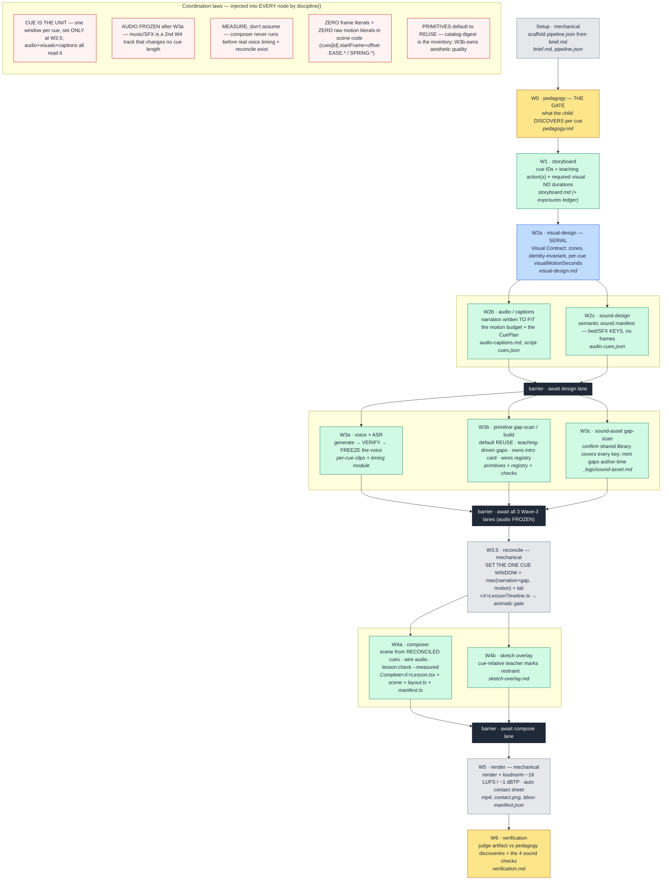

# Animation Test — Lesson Video Pipeline

A Remotion-based pipeline that turns **one authored file** into a finished early-childhood lesson video. You write `lesson-data/<id>/brief.md`; a self-contained workflow drives every wave — pedagogy → storyboard → design → voice → primitives → reconcile → compose → render → verify — and the orchestrator only spawns it and observes.

## The ground truth: `.claude/workflows/lesson-build.js`

> **The workflow JS is the single source of truth for the entire pipeline.** Wave order, the parallel lanes, the discipline laws, and the exact per-node prompts all live in `.claude/workflows/lesson-build.js`. Everything else — this README, `CLAUDE.md`, the skills — is a mirror for ambient sessions. **On any disagreement, the workflow wins.** Improve a *wave* by editing its skill; improve the *chain* by editing the workflow.

The same script feeds both executors with **zero hand-syncing**:

| Executor | Driver | Per-node runner | Use |
| -------- | ------ | --------------- | --- |
| **Dev** | Claude Code `Workflow` tool | Claude subagents | authoring & proving the pipeline |
| **Production** | `pi-runner/` (plain-code, owns the DAG) | one `pi -p` per wave (cheap non-Claude models) | unattended fleet, parallel across lessons |

`pi-runner/extract.mjs` *executes* `lesson-build.js` under recording stubs to derive the identical prompts + DAG — no codegen, no drift. Authoring/proving the Workflow is the only edit; pi runs the same prompts automatically.

## Single input → single command

```bash
cd remotion-svg-primitives
npm run lesson:scaffold -- --id <lesson-id>                       # brief.md -> pipeline.json (mechanical)
npm run lesson:render   -- --config lesson-data/<lesson-id>/pipeline.json
```

The only lesson-specific file you author is `lesson-data/<id>/brief.md` (7 sections: Audience, Length *(scope hint, not a contract)*, Builds-on, Style, Knowledge point, The one beat, Out of scope, Continuity, Narration notes). Everything downstream is derived. Lesson IDs are kebab-case with a curriculum prefix: `kp<n>-<semantic>` (e.g. `kp2-counting-by-tens`).

Production (pi fleet), run by the orchestrator — never the user:

```bash
node pi-runner/run.mjs --lesson <id> --until <wave> --debug
```

## Wave order

Realizes the CLAUDE.md "Subagent Workflow" natively, generated from `lesson-build.js`. Serial backbone (Setup → W0 → W1 → W2a), three `parallel()` lanes (Design / Voice & Assets / Compose) with a barrier between phases, and W3.5 reconcile as the sole cue-window setter. Each node carries its one-line responsibility + primary output artifact. Node colours: 🟨 gate · ⬜ mechanical · 🟦 serial · 🟩 authoring · ⬛ barrier.



> **The nodes above aren't clickable on GitHub** (Mermaid renders inside a sandboxed iframe, so `click`/`href` is blocked). For a **clickable node index** — each node → its skill (the craft) + criteria (what good output looks like), with its input/output artifacts — see the table in [`.agents/skill-system-map.md`](.agents/skill-system-map.md).

`lesson-debugger` (feedback triage) runs **only** after render when the user reports an issue on the MP4 — never during waves 1–6.

## The discipline laws (mirrored from the workflow)

- **The cue is the unit of coordination.** Each cue has ONE timeline window, set by W3.5 reconcile; audio, visuals, and captions all read it. Never re-introduce a `PADDED_CUE_DURATIONS_FRAMES` table the composer applies independently.
- **Narration audio is frozen after W3a.** Once a cue's voice is accepted the WAV is canonical — no re-record for visual fit. If motion overruns, cut flourishes then compress; never extend the cue. (Music + SFX is a *second* track added at W4 that consumes the timeline and changes no cue length.)
- **Measure, don't assume.** The composer never runs before real voice timing (W3a) + reconcile (W3.5) exist. Audio-captions estimates are hints, not contract.
- **Voice output is verified, not trusted.** W3a reads the ASR transcript vs script, walks per-cue matchScore, and fixes timing from evidence before the run advances.
- **Zero frame literals & zero raw motion literals in scene code.** Every frame derives from `cues[id].startFrame + offset`; every curve/spring reaches a named export (`EASE.*`, `SPRING.*`). See `.agents/CAPABILITIES.md`.
- **Primitive quality is owned by W3, not W4.** A bad-looking primitive is a Wave-3 bug — kick back, don't patch in the scene. Default is *compose existing primitives*; a new one ships only when the gap is named.

## Inputs vs outputs (folder split)

- **Inputs — `remotion-svg-primitives/lesson-data/<id>/`** (authored, version-controlled): `brief.md`, `pedagogy.md`, `storyboard.md`, `visual-design.md`, `audio-captions.md`, `audio-cues.json`, `script-cues.json`, scaffolded `pipeline.json`, plus `_logs/<wave>.md`.
- **Outputs — `out/<id>/`** (generated, derivable, `.gitignore`-able): `<id>.mp4`, contact sheet PNG/JSON, `gemini-voice.json`, `asr-alignment.json`, `bbox-manifest.json`, `primitive-checks/`, `verification-frames/`. `outDir` is derived from `lessonId`.
- **Two technical exceptions** (Remotion/TS imports): voice WAV at `public/audio/<id>-voice.wav`; generated timing modules at `src/lessons/generated/<camelId>Timing.ts` + `<camelId>Silences.ts`.

Reusable code under `src/` stays lesson-agnostic — no lesson topics, copy, timings, or paths hardcoded. Primitives live in `src/shape-primitives/` (prop-driven, reusable); the composer consumes them, it doesn't author one-off SVG art.

## Registries & skills

- **`.agents/CAPABILITIES.md`** — the single registry of reusable craft tools (motion vocabulary, PopIn variants, sketch-boil, FX library, styles, generated decorative assets). Read before reaching for any motion/sketch/primitive API.
- **`.agents/TEACHING-ACTIONS.md`** — the pedagogical twin: teaching *moves* and what each `requires`. Planning composes the script from these before any layout; the W3 gap-scan maps move → capability → catalog.
- Each wave loads one focused skill (`lesson-pedagogy`, `lesson-storyboard`, `early-childhood-visual-taste` / `visual-discipline` / `kids-eye`, `lesson-audio-captions`, `lesson-sound-design`, `remotion-lesson-composer`, `sketch-explainer-layer`, `lesson-verification`). Skill ownership and the system map live in `.agents/skill-system-map.md`; the system is evolved continuously via the `hermes-skill-system` skill.

## Observability

Every node is inspectable after the fact, cheapest tier first:

1. **Structured return** — `{ status, outputArtifacts, summary, issues, pipelineFindings }`; the workflow aggregates all returns.
2. **Per-node log** — `lesson-data/<id>/_logs/<wave>.md` (inputs read, outputs written, commands + exit, decisions, issues, findings).
3. **Raw transcript** — the runtime persists each node's full `agent-<id>.jsonl`. The union of all `pipelineFindings` is the workflow-improvement backlog.

## Verification gate

`npm run lesson:check -- --config <path> --measured` — the fast linear pass writes `summary.collisionCount`; the opt-in `--measured` pass renders motion-peak frames, reads each element's true `getBBox()`, and augments `bbox-manifest.json` (`measuredCollisionCount`, `gatesFailed`) plus the LUFS / caption-redundancy / contrast / legibility / motion gates. Advisory, not blocking — but a silent skip is forbidden.

## Dev

- `npm run dev` — Remotion studio (live preview)
- `npm run lint` — ESLint + `tsc`
- `npm run lesson:voice    -- --config <path>` — voice + ASR only
- `npm run lesson:contact-sheet -- --config <path>` — rebuild Wave-6 review surface
- `npm run lesson:animatic -- --config <path>` — cue-boundary animatic + waveform (pre-W4 gate)
