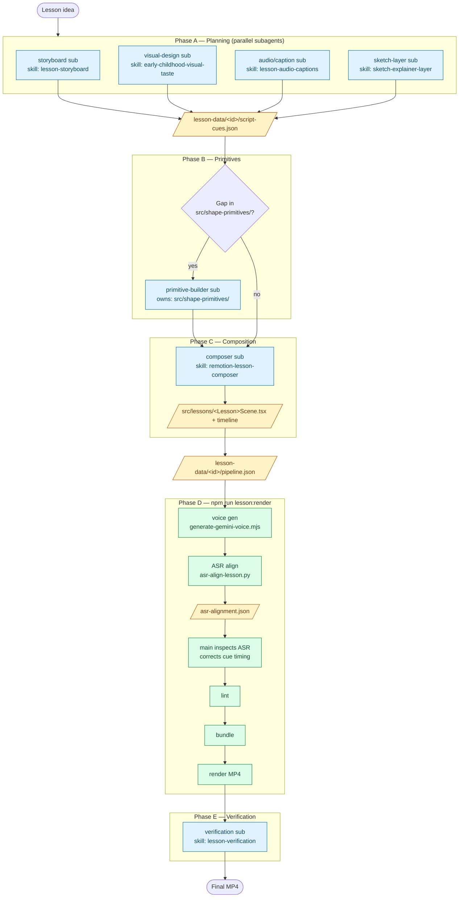

# Animation Test — Lesson Video Pipeline

A Remotion-based pipeline for early-childhood lesson videos. The main agent orchestrates; specialist subagents own discrete artifacts; one config file drives the renderer end-to-end.

## End-to-End Flow



## Skill ↔ Subagent Map

The main agent loads `complete-video-pipeline` as its orchestrator overview. Each subagent is spawned with one focused skill:

| Phase | Subagent          | Skill                          | Owns                                       | Output                                       |
| ----- | ----------------- | ------------------------------ | ------------------------------------------ | -------------------------------------------- |
| A     | storyboard        | `lesson-storyboard`            | (planning only)                            | cue IDs, narration beats, required visuals   |
| A     | visual design     | `early-childhood-visual-taste` | (planning only)                            | object choices, layout, tone, clarity risks  |
| A     | audio / captions  | `lesson-audio-captions`        | (planning only)                            | teacher script, caption text, cue boundaries |
| A     | sketch layer      | `sketch-explainer-layer`       | (planning only)                            | teacher-mark / pointer plan                  |
| B     | primitive builder | (none — design rule)           | `src/shape-primitives/` + focused demos    | new prop-driven primitives                   |
| C     | composer          | `remotion-lesson-composer`     | `src/lessons/<Lesson>*.tsx` + timeline     | composed scene, timing from cues             |
| E     | verification      | `lesson-verification`          | (read-only review)                         | render-readiness report                      |

The main agent itself owns: `lesson-data/<id>/pipeline.json`, ASR cue-timing corrections, and merging subagent artifacts.

## Per-Lesson Artifacts

Everything lesson-specific lives in `remotion-svg-primitives/lesson-data/<lesson-id>/`:

```
pipeline.json         # config the renderer reads (composition, entry, output, voice, paths)
script-cues.json      # narration + cue plan (from Phase A)
gemini-voice.json     # voice-gen output metadata
asr-alignment.json    # detected transcript + token timings (production artifact, not a gate)
```

Reusable code under `remotion-svg-primitives/src/` stays lesson-agnostic — no lesson topics, copy, timings, or paths hardcoded.

## Single Entry Point

```bash
cd remotion-svg-primitives
npm run lesson:render -- --config lesson-data/<lesson-id>/pipeline.json
```

The runner script executes, in order: voice generation → ASR alignment → lint+typecheck → bundle → `remotion render` → ffprobe of the output. Add `-- --skip-voice` to reuse an existing aligned voice file (e.g. after fixing cue timing).

## ASR Alignment

ASR output is an owned artifact, not a pass/fail check. After voice gen the main agent inspects the detected transcript, token events, timestamps, and tokenizer settings, then corrects cue timing in `script-cues.json` from evidence before re-rendering with `--skip-voice`.

## Dev

- `npm run dev` — Remotion studio (live preview)
- `npm run lint` — ESLint + `tsc`
