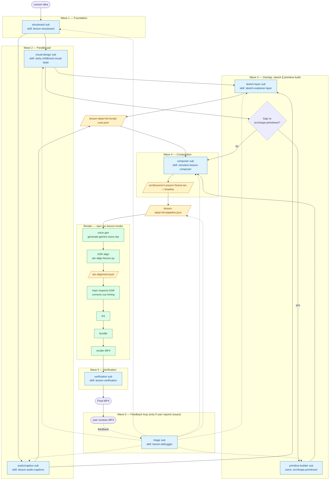

# Animation Test — Lesson Video Pipeline

A Remotion-based pipeline for early-childhood lesson videos. The main agent orchestrates; specialist subagents own discrete artifacts; one config file drives the renderer end-to-end.

## End-to-End Flow

Planning runs in **waves**, not as a single parallel fan-out. Each downstream subagent gets concrete inputs instead of guessing, so the main agent does less reconciliation. Primitive-gap-scan and primitive-builder overlap with `sketch-layer` for latency.



## Skill ↔ Subagent Map

The main agent loads `complete-video-pipeline` as its orchestrator overview. Each subagent is spawned with one focused skill and waits on declared upstream inputs.

| Wave | Subagent          | Skill                          | Depends on                       | Owns                                    | Output                                       |
| ---- | ----------------- | ------------------------------ | -------------------------------- | --------------------------------------- | -------------------------------------------- |
| 1    | storyboard        | `lesson-storyboard`            | lesson idea                      | (planning only)                         | cue IDs, narration beats, required visuals   |
| 2    | visual design     | `early-childhood-visual-taste` | storyboard                       | (planning only)                         | object choices, layout, tone, clarity risks  |
| 2    | audio / captions  | `lesson-audio-captions`        | storyboard                       | (planning only)                         | teacher script, caption text, cue boundaries |
| 3    | sketch layer      | `sketch-explainer-layer`       | visual-design + audio/captions   | (planning only)                         | teacher-mark / pointer plan                  |
| 3    | primitive builder | (none — design rule)           | visual-design (via gap scan)     | `src/shape-primitives/` + focused demos | new prop-driven primitives                   |
| 4    | composer          | `remotion-lesson-composer`     | all Wave 1–3 artifacts           | `src/lessons/<Lesson>*.tsx` + timeline  | composed scene, timing from cues             |
| 5    | verification      | `lesson-verification`          | rendered MP4                     | (read-only review)                      | render-readiness report                      |
| 6    | triage (feedback) | `lesson-debugger`              | user feedback on rendered MP4    | (planning only)                         | smallest fix + re-spawn target               |

The main agent itself owns: `lesson-data/<id>/pipeline.json`, the primitive gap-scan decision, ASR cue-timing corrections, and merging subagent artifacts into `script-cues.json`.

## Per-Lesson Artifacts

Everything lesson-specific lives in `remotion-svg-primitives/lesson-data/<lesson-id>/`:

```
pipeline.json         # config the renderer reads (composition, entry, output, voice, paths)
script-cues.json      # narration + cue plan (from Phase A)
gemini-voice.json     # voice-gen output metadata
asr-alignment.json    # detected transcript + token timings (production artifact, not a gate)
```

Reusable code under `remotion-svg-primitives/src/` stays lesson-agnostic — no lesson topics, copy, timings, or paths hardcoded.

## Single Entry Point

```bash
cd remotion-svg-primitives
npm run lesson:render -- --config lesson-data/<lesson-id>/pipeline.json
```

The runner script executes, in order: voice generation → ASR alignment → lint+typecheck → bundle → `remotion render` → ffprobe of the output. Add `-- --skip-voice` to reuse an existing aligned voice file (e.g. after fixing cue timing).

## ASR Alignment

ASR output is an owned artifact, not a pass/fail check. After voice gen the main agent inspects the detected transcript, token events, timestamps, and tokenizer settings, then corrects cue timing in `script-cues.json` from evidence before re-rendering with `--skip-voice`.

## Dev

- `npm run dev` — Remotion studio (live preview)
- `npm run lint` — ESLint + `tsc`
